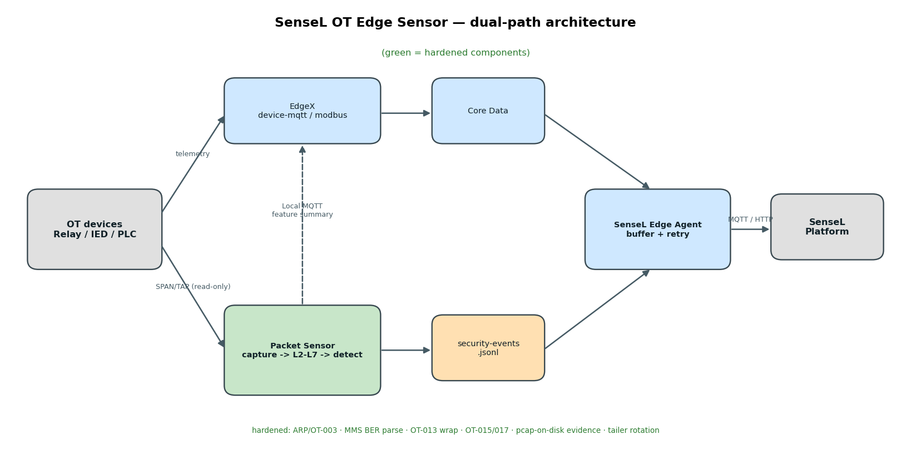
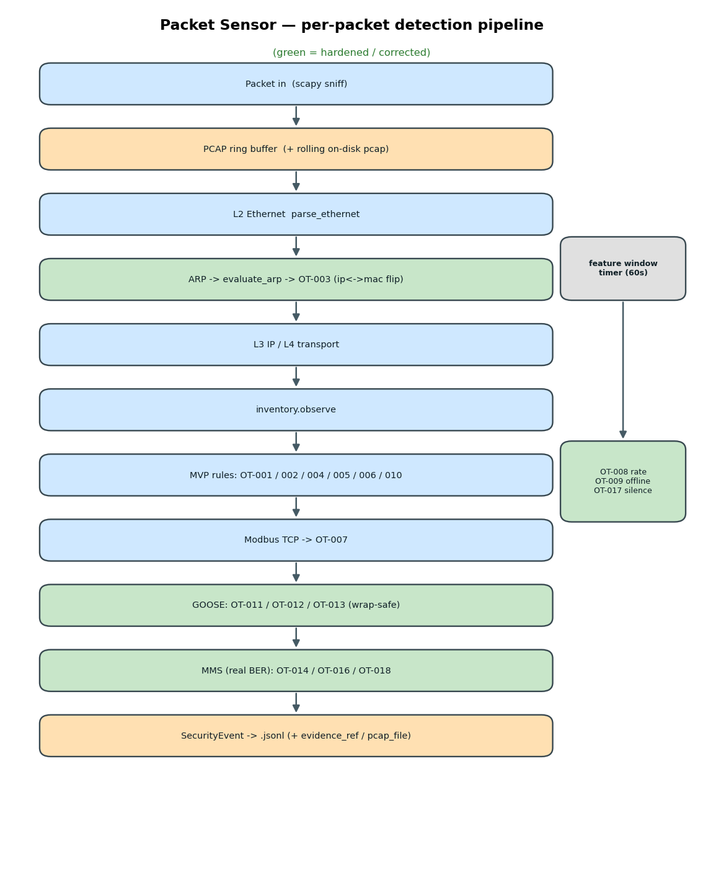

# SenseL OT Edge Sensor

> 產品代號：SenseL RelayGuard  
> 邊緣部署的 OT 資安與遙測閘道器，整合 EdgeX 主動遙測與被動鏡像流量監控。

## 這個分支：`hardening-v1` — 為什麼、差在哪、優勢

> `main` 的偵測器「能 demo，但對不起電驛場景」。本分支把它修到**可信**，並補上**真實攻擊驗證**。

**為什麼存在**：稽核 `main` 時發現多個讓偵測「裝了卻不會響」或「誤報連連」的問題，且沒有任何能證明偵測有效的測試。

**與 `main` 的差異（before → after）**

| 面向 | `main` | `hardening-v1` |
|------|--------|----------------|
| OT-003（ARP / MAC-IP） | 順序＋大小寫 bug → 幾乎不會觸發；且不解析 ARP | 修正＋新增 ARP 解析，ARP spoofing 真的抓得到 |
| MMS 分類 | `b"write" in payload` 字串比對 → 誤判/漏判 | 真正解析 TPKT/COTP + BER PDU |
| OT-013 GOOSE stNum | 計數合法回繞（2³²）就誤報 | wrap-safe，只抓 replay / 大跳躍 |
| OT-015 / OT-017 | 列在規則表但**未實作** | 實作完成（MMS 速率 / GOOSE 靜默） |
| 攻擊驗證 | 無 | OT-001~018 真實攻擊 + 決定性自測 |
| 重啟 / log 輪替 | tailer 靜默漏事件 | 偵測輪替、安全重讀 |
| 證據 | 純記憶體（重啟即失） | 可滾動落盤 pcap |
| 測試 | 脆弱（每檔 `sys.modules` hack） | 集中化、順序無關 |

**優勢**：偵測**真的會觸發、誤報更少**、有**可重現的端到端驗證**（`make verify-attacks` → OT-001~018 全綠），可放心當作後續重做的穩固基礎。細節見 [hardening-v1 設計文件](docs/hardening-v1.md)。

## 架構概覽

```
OT 設備 ──► EdgeX Device Services ──► SenseL Exporter ──► SenseL Platform
     │
     └── SPAN/TAP ──► Packet Sensor Agent ──► 本地偵測 ──► SenseL Platform
```



**設計原則**：原始鏡像流量不直接進入 EdgeX；被動流量由 Packet Sensor 處理，僅上傳解析後的特徵摘要、安全事件與證據參考。詳見 [hardening-v1 設計文件](docs/hardening-v1.md)。

## 偵測流程

每個封包先進 PCAP ring buffer（證據保全），再逐層解析、逐條規則評估；速率/離線/靜默類規則掛在每 60s 的 feature window（綠色為 hardening-v1 強化/修正處）：



## 專案結構

| 目錄 | 說明 |
|------|------|
| `edgex/` | EdgeX Foundry 堆疊與 Device/App Services |
| `services/packet-sensor/` | 被動封包擷取、L2–L7 解析、本地異常偵測 |
| `services/sensel-edge-agent/` | 與 SenseL 平台通訊、政策同步、健康回報 |
| `services/mqtt-broker/` | 本地 MQTT（特徵摘要 → EdgeX device-mqtt） |
| `config/` | 感測器、擷取、政策與 EdgeX 設定 |
| `schemas/` | Telemetry / Security Event / Health JSON Schema |
| `deploy/` | Ubuntu 與 Pi4 部署腳本與網路設定範本 |
| `docs/` | 架構、部署與 API 文件 |

## 快速開始（Ubuntu）

```bash
# 1. 複製環境變數
cp .env.example .env
# 編輯 SENSEL_API_URL、API_KEY、SITE_ID、SENSOR_ID 等

# 2. 複製感測器設定
cp config/sensor.yaml.example config/sensor.yaml

# 3. 啟動完整堆疊
docker compose up -d

# 4. 健康檢查
./scripts/health-check.sh
```

詳見 [docs/deployment-ubuntu.md](docs/deployment-ubuntu.md)。

## 部署目標

| 階段 | 平台 | 說明 |
|------|------|------|
| MVP / Lab | Ubuntu Server 22.04/24.04 | 開發與 PoC 驗證 |
| Field | Raspberry Pi 4 (8GB) | 客戶現場部署 |

Pi4 部署見 [docs/deployment-pi4.md](docs/deployment-pi4.md)。

## MVP 功能範圍

- [x] 專案骨架與目錄配置
- [x] EdgeX Core + device-mqtt + device-modbus（compose 已合併；Modbus：`make verify-modbus`；MQTT feature summary：`make verify-mqtt`）
- [x] Packet Sensor：Sprint 1 擷取迴圈 + L2/L3 + MVP 規則 OT-001~010（`make verify-mvp`）
- [x] 本地規則偵測（OT-001 ~ OT-010）+ IEC 61850（OT-011~018）
- [x] PCAP ring buffer（記憶體 ring + `evidence_ref`）
- [x] SenseL 健康上傳 + 安全事件上傳（Edge Agent tail JSONL → mock/平台）
- [x] Pi lab Events Viewer（`http://<pi-ip>:8080`，方案 B）
- [ ] SenseL 平台 OT Dashboard 整合

## 相關文件

- [架構說明](docs/architecture.md)
- [API 契約](docs/api-contracts.md)
- [偵測規則](docs/detection-rules.md)
- [PRD 摘要](docs/PRD.md)
- [Sprint 規劃](docs/sprint-plan.md)
- [S1-02b IEC 61850 被動 backlog](docs/sprint-s1-02b-iec61850.md)
- [**hardening-v1 設計文件**（偵測強化、攻擊 lab、含流程圖）](docs/hardening-v1.md)

## 授權

Proprietary — SenseL / 內部使用
