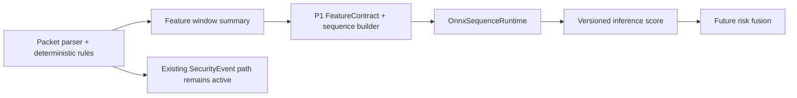

# SenseL Edge ARM64 ML Runtime Audit

本次 P0-C audit 的結論很直接：目前 `packet-sensor` 是規則與 signature-based detection pipeline，尚未包含 Isolation Forest、XGBoost 或 Tiny LSTM model runtime。現況沒有「LSTM 載入後回傳 null」的 code path；`null` 代表功能尚未實作或上層規格預留值，而不是現有模型損壞。

## 🔎 現況證據

| 問題 | Repository 現況 | 結論 |
|---|---|---|
| Feature extraction | `FeaturePublisher` 輸出 window summary，但沒有凍結 ML feature vector/order | 需先建立 `FeatureContract` |
| Isolation Forest | 無 sklearn model、loader 或 artifact | 未實作 |
| XGBoost | 無 xgboost dependency、model 或 invoke path | 未實作 |
| Tiny LSTM | 無 PyTorch、ONNX model、sequence builder 或 runtime | 未實作，不是 runtime null bug |
| PyTorch runtime | requirements 與 image 均未包含 | Edge 不需要加入 PyTorch |
| ONNX export | 沒有可匯出的 checkpoint、network definition 或 normalization metadata | 現階段不可聲稱已完成 export |
| Existing detection | OT-001～019、IEC 61850、IOC、Snort、Suricata | 可保留為 deterministic detection input |

> [!WARNING]
> 在 feature order、normalization、sequence length 與 label meaning 尚未凍結前直接訓練模型，會產生無法安全部署或 federate 的 artifact。

## 🏗️ P0-C Runtime 邊界

新增的 `OnnxSequenceRuntime` 是可觀測 adapter，不會接管 packet hot path。它提供 `disabled`、`missing`、`dependency_missing`、`load_error`、`ready` 與 `inference_error` 狀態；模型不可用時回傳 explicit unavailable result，而不是靜默 `None`。



Runtime 使用單執行緒 `CPUExecutionProvider` 與 sequential execution，避免在 1 GB 級 Edge device 產生不可控 thread/memory contention。ML dependencies 由 Docker build arg `INSTALL_ML_RUNTIME=true` 選用；預設 packet-sensor image 不增加重量。

本輪 image size 為 base 約 70.3 MB、啟用 ONNX Runtime 約 110.8 MB，增加約 40.5 MB。因此預設維持停用，只有需要本地 sequence inference 的 hardware profile 才安裝。

---

## 🧪 Smoke Model 與 Benchmark

`tests/fixtures/sequence-risk-smoke.onnx` 是未訓練的 `ReduceMean` graph，只驗證 ARM64 wheel、tensor shape、session load、推論與量測流程。它不是 Tiny LSTM，也不能進 production registry。

Fixture 使用 `requirements-ml-tools.txt` 的 development-only `onnx` package 產生；Tier 1 runtime 不安裝 exporter。

建立含 ONNX Runtime 的 image：

```bash
docker build \
  --build-arg INSTALL_ML_RUNTIME=true \
  -t sensel-packet-sensor:onnx-p0 \
  services/packet-sensor
```

在 target hardware 量測：

```bash
docker run --rm \
  -v "$PWD/services/packet-sensor/tests/fixtures:/fixtures:ro" \
  sensel-packet-sensor:onnx-p0 \
  python -m src.inference.benchmark \
    --model /fixtures/sequence-risk-smoke.onnx
```

P0 smoke budget 為 batch 1、shape `[1,8,4]`、p95 ≤ 25 ms、process max RSS ≤ 256 MiB。這只是 runtime gate；P1 真實 Tiny LSTM 必須另設較嚴格、依硬體 profile 區分的 budget。

本輪在 ARM64 開發主機與 ARM64 Python 3.11 container 的實測如下：

| 環境 | p95 | Process max RSS | 結果 |
|---|---:|---:|---|
| macOS ARM64 / Python 3.12 | 0.0162 ms | 52.73 MiB | Pass |
| Linux aarch64 container / Python 3.11 | 0.0060 ms | 56.74 MiB | Pass |

> [!NOTE]
> Docker 數字來自 Docker Desktop VM，且 graph 只有 314 bytes。這些結果證明 runtime/toolchain 可用，不可外推為真實 Tiny LSTM latency。

---

## 📌 P1 前置工作

1. 定義 `FeatureContract`：欄位順序、dtype、normalization、missing value 與版本。
   Model output 也必須定義為已校準的 `[0,1]` risk score；raw logits 不可直接進 fusion。
2. 建立 sequence builder，明確定義 asset/session grouping 與時間窗。
3. 取得可重現的 Tiny LSTM training code、checkpoint、dataset lineage 與 evaluation report。
4. 在 training environment 匯出 ONNX；Edge image 只安裝 ONNX Runtime。
5. 將 inference result 加入 protobuf `InferenceScore`，再進行 risk fusion 與 Trust Episode。
6. Isolation Forest 與 XGBoost 先各自建立 adapter；XGBoost federation 不得套用 FedAvg。
