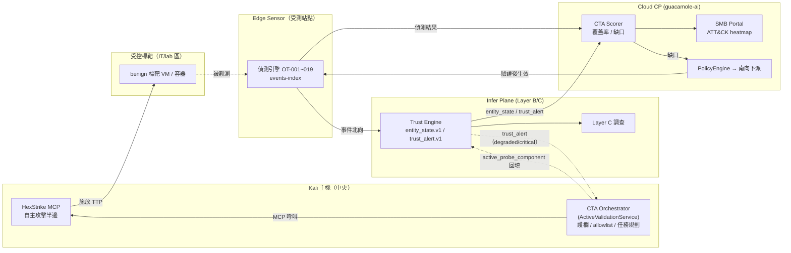

# Continuous Trust Assurance（CTA）— 概念架構與 PoC 範圍

> 狀態：Draft v0.1｜對象：產品/架構/CTI 團隊｜關聯：[system-architecture-trust-layer-prd.md](system-architecture-trust-layer-prd.md)
>
> 一句話定位：**把 HexStrike（自主攻擊半邊）接上既有的 Trust Engine + 分散式 edge 艦隊 + Layer C 調查，形成一個持續證明「偵測/信任/enforcement 全鏈有效」的閉環。**

---

## 0. 為什麼做這個（命題）

我們的結構性優勢：**同時擁有攻擊面（HexStrike）與防禦遙測面（edge 艦隊 + Trust Engine + Layer C）**。市面 BAS 工具不懂 OT、更不懂我們的信任模型；純 CTI validation 又只是入門款。

把兩半接起來 = **自我驗證的安全平台**。產品定位從「偵測工具」升級為 **Continuous Trust Assurance（持續信任保證）**：不只偵測，而是**持續證明偵測有效、信任分數可信、缺口能自動補**。

本 PoC 聚焦兩支柱：

- **支柱 1：持續式 BAS** — 量測整條偵測管線的 ATT&CK 覆蓋率並產缺口報告。
- **支柱 2：主動證據型信任** — 信任降級時觸發主動驗證，把「觀察」升級為「實證」，回填 Unified Trust Score。

---

## 1. 閉環資料流



---

## 2. 兩支柱設計

### 支柱 1：持續式 BAS（偵測覆蓋率）

| 步驟 | 動作 | 量測點 |
|------|------|--------|
| ① 施放 | CTA Orchestrator 透過 HexStrike 在 **IT/lab 受控標靶**執行單一 ATT&CK 技法 | 記錄 `technique_id` + 施放時窗 |
| ② 偵測 | Edge Sensor 是否在時窗內產生對應事件 | `events-index` / OT-001~019 |
| ③ 信任 | Layer B 是否把對的實體降級 | `entity_state.v1` |
| ④ 調查 | Layer C 是否關聯成案 | case writeback |
| ⑤ 評分 | 算 detect / trust / investigate 三段命中，產覆蓋率 | `cta.coverage.v1` |
| ⑥ 補洞 | 缺口 → 提議規則 → 重現驗證後南向下派 | `PolicyEngine.build()` |

**產出**：每租戶一張 **ATT&CK 覆蓋率 heatmap + 缺口清單**，進 SMB Portal。

### 支柱 2：主動證據型信任（active-evidence trust）

| 觸發 | 動作 | 回填 |
|------|------|------|
| `trust_alert.v1`（suspicious/degraded/critical） | CTA 對該實體做**受限主動驗證**（依 zone 分級，OT 區僅唯讀） | 確認/推翻 → 寫 `active_probe_component` 進 `reason_log` |

**效果**：對齊 PRD §4.5 Unified Trust Score，信任分數從「行為觀察」升級為「主動實證」。attestation/probe 命中可直接 gating 到 critical → 餵 ZTNA PEP。

---

## 3. 接點與訊息契約（草案）

### 3.1 任務派發（南向，新 topic）
- MQTT：`sensel/{tenant_id}/cta/task`（認證沿用 SMB API Key）
- 建議用 **declarative reconcile**（抄 VPN supervisor 的 `desired.json` 模式）：CP 寫期望任務，edge/標靶端自我 reconcile、crash-safe。

```jsonc
// cta.task.v1
{
  "schema": "cta.task.v1",
  "task_id": "uuid",
  "mode": "bas | active_probe",        // 支柱1 / 支柱2
  "technique_id": "T1046",             // BAS：ATT&CK 技法
  "target": { "zone": "it_lab", "ref": "target-vm-01" },
  "entity_id": "ws-eng-07",            // active_probe：待驗證實體
  "tool_allowlist": ["nmap-sv", "httpx", "nuclei-tech"],
  "constraints": { "rate_limit_pps": 50, "max_duration_s": 120 },
  "window": { "not_before": "...", "not_after": "..." }
}
```

### 3.2 結果回報（北向，複用既有）
- `POST /api/v1/sightings` 或新增 `cta-result` event → 餵 `enrichment_service`（新 source `ACTIVE-VALIDATE` / `CTA-BAS`）。

```jsonc
// cta.result.v1
{
  "schema": "cta.result.v1",
  "task_id": "uuid",
  "mode": "bas",
  "technique_id": "T1046",
  "emitted_at": "...",
  "detection": { "edge_event": true, "rule_ids": ["OT-002"], "latency_ms": 1830 },
  "trust": { "entity_id": "...", "degraded": true, "level_before": 0.91, "level_after": 0.62 },
  "investigation": { "case_opened": true, "case_id": "..." },
  "evidence_ref": "local-ringbuffer://..."
}
```

### 3.3 覆蓋率聚合（CP 內部）
```jsonc
// cta.coverage.v1
{
  "schema": "cta.coverage.v1",
  "tenant_id": "...",
  "generated_at": "...",
  "techniques": [
    { "technique_id": "T1046", "tactic": "Discovery",
      "detect": true, "trust": true, "investigate": false, "score": 0.67 }
  ],
  "summary": { "total": 8, "fully_covered": 5, "gaps": ["T1110", "T1071"] }
}
```

### 3.4 信任回填（支柱 2）
- Layer B `TrustScoreEngineV1` 的 `reason_log` 新增 `active_probe_component`；probe 確認受損 → 直接 gating 至 critical。

### 3.5 全程稽核
- 每一次 MCP tool call 記錄（工具、目標、zone、結果、latency）；複用 `EnrichmentAuditRepository.record(...)` 的 pattern。

---

## 4. OT 安全前提（硬性約束）

| zone | 允許 | 禁止 |
|------|------|------|
| **IT / lab 受控標靶** | BAS 全功能（HexStrike 施放 TTP） | 對 OT 目標 |
| **客戶 IT 網段** | 主動驗證（需 RoE + scope） | 未授權目標 |
| **OT 網段（L1/L2）** | **僅**既有 opt-in 唯讀指紋（Modbus FC43、TCP fingerprint，*Never writes*） | nmap 積極掃、nuclei、任何 write、exploitation |

- BAS 不需要打 OT 設備：**在 IT 區重現 TTP，量測 OT 偵測管線的反應**即可。
- 護欄集中在 Kali 端：tool allowlist、禁 exploitation、human-in-loop gate、rate limit。**禁止 LLM 對 OT 目標自由呼叫工具。**

---

## 5. PoC 範圍（分階段）

| 階段 | 目標 | 交付 | 退出條件 |
|------|------|------|----------|
| **P0 骨架** | Kali + HexStrike MCP，CTA Orchestrator + allowlist + audit | MCP client 可受控執行單一工具並稽核 | 單技法可手動觸發、有 audit log |
| **P1 支柱 1 MVP** | 在 lab 跑首批 ATT&CK 技法，量測 detect + trust | `cta.coverage.v1` + Portal heatmap 雛形 | 首批技法覆蓋率可重現產出 |
| **P2 支柱 2 MVP** | `trust_alert` 觸發主動驗證，回填 `active_probe_component` | Layer B `reason_log` 多一個 component | degraded 實體可被主動驗證並改分 |
| **P3 補洞閉環** | 缺口 → 規則重現驗證 → 南向下派 | 「重現驗證 gate」插在 build→dist 之間 | 至少 1 條規則經驗證後下派並回測命中 |

**範圍外（PoC 不做）**：OT 網段主動掃描、exploitation 工具、自動 enforcement（先 audit-only）、多租戶規模化。

---

## 6. 第一批可驗的 ATT&CK 技法清單（P1）

挑選原則：**對應既有 OT-001~019 偵測規則、在 IT/lab 區安全可重現、低破壞性**。

| # | Technique | ID | Tactic | 對應偵測 | 重現方式（lab） |
|---|-----------|----|--------|----------|------------------|
| 1 | Network Service Discovery | T1046 | Discovery | 埠掃描偵測（OT-002 類） | `nmap -sV` 對標靶 VM |
| 2 | Remote System Discovery | T1018 | Discovery | 掃描/探測行為 | `nmap -sn` ping sweep（lab 段） |
| 3 | Active Scanning | T1595 | Recon | 異常探測流量 | `httpx` / `masscan`（限速）對標靶 |
| 4 | Brute Force | T1110 | Cred Access | 認證失敗洪峰 | `hydra` 對標靶服務（lab 帳號） |
| 5 | Exploit Public-Facing App | T1190 | Initial Access | nuclei 指紋/已知弱點 | `nuclei` tech-detect 對標靶 |
| 6 | Application Layer Protocol / C2 | T1071 | C2 | TLS 指紋（ja3/ja4） | 標靶發 beacon-like 流量 |
| 7 | Non-Standard Port | T1571 | C2 | 非標準埠通訊 | 標靶開非標準埠服務 |
| 8 | Modbus（唯讀重放，lab 模擬器） | T0846/T0861* | OT Discovery | OT-001/Modbus 規則 | 對 **lab Modbus 模擬器**唯讀查詢 |

> *ICS ATT&CK；第 8 項僅對 **lab 模擬器**，永不對真實 OT 設備。

---

## 7. 成功指標（KPI）

- **覆蓋率可量測**：首批 8 技法可重現產出 `cta.coverage.v1`，detect/trust/investigate 三段分數穩定。
- **閉環有效**：至少 1 個缺口 → 規則重現驗證 → 下派 → 回測由「未偵測」變「偵測」。
- **信任實證**：至少 1 個 degraded 實體經主動驗證後，`reason_log` 出現 `active_probe_component` 並改變 trust level。
- **零 OT 影響**：全程無任何工具觸及 OT 網段（audit log 可證）。

---

## 8. 開放議題

- 受控標靶的維運：lab VM/容器的生命週期、隔離、清場。
- BAS 排程節流：避免與真實事件混淆（施放時窗需明確標記，供 Scorer 去噪）。
- HexStrike 工具可靠度與版本治理：當編排層用，allowlist 白名單管理。
- 跨三專案的 `tenant_id` 對齊：CTA 任務/結果需貫穿 edge ↔ Infer ↔ Cloud CP。
- enforcement 邊界：PoC 先 audit-only，未來接 ZTNA PEP 時的 fail-open/secure 政策。

---

## 9. PoC 首次端到端驗證紀錄（P0 Milestone — 2026-06-13）

> 結論：**CTA 閉環 detect → 北向 → Layer A/B/C 分析 → 落地，已在實機 lab 端到端打通。**

### 9.1 實機 lab 拓撲（實測）

| 主機 | 角色 | 規格 / 服務 |
|------|------|-------------|
| `192.168.1.153` | 攻擊端宿主（Windows 10） | Intel N200 / 8GB；VMware 跑 Kali（guest `192.168.80.129`，NAT）；Docker |
| `192.168.1.124` | 防禦 Edge Sensor（Raspberry Pi） | 4 核 aarch64 / 3.7GB；packet-sensor + edge-agent + EdgeX + 2×mosquitto |
| `192.168.1.203` | MQTT Broker + LLM + Layer A/B/C | Ollama 11434（gemma2:9b、DeepHat-V1-7B）；MQTT 1883；Layer C UI 8000 |
| `192.168.1.108` | Cloud CP（Ubuntu, 30GB） | guacamole-ai API 8081 + Wazuh + postgres + redis |

> 註：Edge `eth0`（擷取網卡）無載波，PoC 改用 **wlan0 擷取**（Option B），標靶 = Edge 自身；BPF 暫放寬為 `tcp and host 192.168.1.124`。正式 PoC 應改 eth0 接交換器 SPAN。

### 9.2 已驗證的閉環（T1046 Network Service Discovery）

```
Kali(NAT→192.168.1.153) --nmap -sT--> Edge .124 (wlan0 擷取)
  → packet-sensor 偵測 OT-005 NEW_DESTINATION_PORT（單次 ~198 筆）
  → edge-agent 北向 MQTT → 192.168.1.203:1883
     topic: ot-edge/company-a9ae1234648ee138/factory-lab-001/ot-edge-001/events/v1
     payload 帶完整歸因：src_ip=192.168.1.153 → dst 192.168.1.124:<port>
  → Layer A/B 推論：episode 化（schema layerB.episode.v1，30s 視窗，OT-L2 zone，Trust 實體圖）
  → Layer C → 落地 .108 DB：smb_ot_security_events（layer=layer_c）
```

| 段 | 狀態 | 證據 |
|----|------|------|
| ① 攻擊 | ✅ | Kali 經 VMware Tools `runScriptInGuest` 跑 nmap |
| ② 偵測 | ✅ | packet-sensor 擷取 81→6279 封包、198× OT-005 |
| ③ 北向 MQTT | ✅ | `mosquitto_sub` 即時收到事件，含 `src_ip=192.168.1.153` |
| ④ Layer A/B episode + Trust 上下文 | ✅ | raw_event_json = `layerB.episode.v1`，entities/zone 圖 |
| ⑤ 落地 .108 DB | ✅ | `smb_ot_security_events` 404 列、持續增加、sensor `ot-edge-001` |
| LLM triage（.203） | ✅（推論活躍） | Ollama VRAM 載入 gemma2:9b；DeepHat 已裝未載 |

### 9.3 關鍵發現（待修正 / 設計輸入）

1. **攻擊歸因在 episode 化時遺失**：`.108` DB `source_ip` 全為 `null`（MQTT payload 原本有 `.153`）。BAS 攻擊關聯需保留攻擊者 IP，或以 `mqtt_trace_id`/時間戳關聯。
2. **burst 被 30s episode 視窗聚合**：唯一約束 `(tenant_id, episode_id, layer)` 使 198 筆 burst 在 DB 僅剩極少數列。**覆蓋率計數須在邊緣/MQTT 層計，不能只數 .108 列**。
3. **Trust Engine 已介入**：episode 帶實體/zone 圖（`.124`/`.108` 視為 OT-L2 實體）→ 支柱 2（信任評分）的天然接點。

### 9.4 維運注意事項

- **Kali VM 啟動**：Windows OpenSSH 會在 session 結束時殺掉子進程，`vmrun start` 經 SSH 啟動的 VM 會被收掉。**解法：用排程任務 `KaliBoot`（schtasks）啟動**，脫離 SSH session。
- **NAT 歸因**：Kali 在 VMware NAT 後，sensor 看到的來源是宿主 `.153`。要看真實 Kali IP 需改 **bridged** 網路。
- **baseline 雜訊**：wlan0 baseline 未重學前，Edge 自身對外連線也會觸發 OT-005；乾淨訊號前建議重學 baseline。
- **OT-005 一次性**：NEW_DESTINATION_PORT 只在首見埠觸發；重測需掃**新埠段**。

### 9.5 支柱 1「調查」段 + 支柱 2「信任」段驗證（2026-06-13 補）

> Layer A/B/C + Trust Engine 跑在 `.203`（**Mac mini, Apple Silicon, 原生執行**，非 docker；`/Users/avocado.ai/Aristaconnector-Control-Plane`）。

**✅ 支柱 1 ③「調查」段（Layer C AgenticRAG）運作中**
`outputs/audit/run-ot-*.jsonl` 顯示我們的 `ip:192.168.1.124` 掃描 episode 被多代理調查處理：
```
agent triage → hunt_planner → response_advisor（citations=4, latency 6-9ms）
```

**✅ 支柱 2「信任」段（b2_trust Trust Engine）運作中**
`outputs/layerc_bridge/ep2:*:ip:192.168.1.124:*.json` 內嵌 entity_state：
```
matched_entity_key = identity:ot-sensor:ot-edge-001
trust_score = 0.0           # 已降至最低 (critical)
recent_labels = [ot_new_dst_port × N]   # 掃描事件驅動
trust_delta = 0.0
```
→ Trust Engine **確實對實體計算信任並被惡意事件壓到 0.0**。

**⚠️ nuance（重要設計輸入）**：因 wlan0 baseline 未重學，持續的 `ot_new_dst_port` 雜訊已把信任**釘在 0**，故新掃描看不到乾淨的「信任下降 delta」。**乾淨的支柱 2 demo 需先重學 baseline（實體回到 healthy ≈1.0）→ 再施放掃描 → 觀察 trust 下降**。

### 9.6 `.203` 實際架構釐清（2026-06-13 補）

> 之前誤以為 inferplane 是原生 python；實測為 **Docker 化**。

| 項目 | 實況 |
|------|------|
| 主機 | **Mac mini, Apple M4 / 10 核 / 16GB**（macOS, 非 Linux） |
| Layer A/B/C | **Docker 容器**：`layera-layerc-bridge`、`layera-layerc-api`、`layerb-worker`、`layera-layerc-postgres` 等；由 launchd `com.avocado.layera` → `scripts/layerA-mac-boot.sh` → `docker compose -f docker-compose.yml -f docker-compose.layerc.yml up -d` 啟動 |
| MQTT broker | **EMQX**（1883），非 mosquitto |
| LLM（原設計） | 容器 `LLM_OLLAMA_PRIMARY=http://host.docker.internal:11434`，正常經 **2-hop SSH tunnel**（`com.sensel.ollama-tunnel` → `ollama_tunnel_c2_123.sh`，jump `159.223.69.107`）轉到**遠端 GPU 的 Ollama** |
| LLM（目前 lab） | tunnel 已壞（exit 255）；改用**本機 Ollama（Apple Metal）跑小模型 `gemma2:2b`** |

### 9.7 本次發現的 Bug（皆已處理）

| # | Bug | 根因 | 修復 |
|---|-----|------|------|
| B1 | **OT triage `[Errno 101] Network is unreachable`** | 本機 Ollama 被 launchd `com.avocado.ollama-paused` **每 600s `pkill ollama`**；同時遠端 tunnel exit 255 → `:11434` 無人應答 | **已修**：停用 paused 殺手（改名 `.disabled`）＋新增 `com.avocado.ollama-serve.plist`（`RunAtLoad`+`KeepAlive`，`OLLAMA_KEEP_ALIVE=5m`，`MAX_LOADED_MODELS=1`）。已驗 kill 後 launchd 自動拉回 |
| B1b | **`POST /api/chat 404`** | 容器 `LLM_MODEL=gemma2:9b`、`OT_LLM_ESCALATION_MODEL=gemma2:9b`（本機未裝；只有 `gemma2:2b`） | **已修**：`deployments/layerA/.env` 加 `LLM_MODEL=gemma2:2b`/`OT_LLM_MODEL=gemma2:2b`/`OT_LLM_ESCALATION_MODEL=gemma2:2b`，recreate `layerc-api`。容器內實測 `gemma2:2b→200`、`gemma2:9b→404`（佐證根因） |
| B2 | **C3 writeback 422**：`mode='live'` 不在 `Literal["dry_run","review","auto"]` | guacamole-ai schema 太窄 | **已修**：`api/routes_cases_writeback.py:30` 加入 `"live"` |

> **資源**：M4/16GB 下，`ollama serve` idle ~60MB/0% CPU；`gemma2:2b` 載入佔 ~1.9GB 統一記憶體、單次推論 ~1s；keep_alive 5m 過後卸載歸還。持續開負擔極輕。
>
> **回切遠端 LLM**：還原 `com.avocado.ollama-paused.plist`、修好 `com.sensel.ollama-tunnel`、卸載 `com.avocado.ollama-serve` 即可。

### 9.8 支柱 2 乾淨 delta 實測（2026-06-13，T1046 重測）

> 目標：把信任分數從「被雜訊釘在 0」還原成可觀察的「攻擊造成的下降 delta」。

**做法（兩個關鍵動作）**
1. **收窄擷取訊號**：`.124` 的 `CAPTURE_BPF_FILTER` 改為 `tcp and host 192.168.1.153 and host 192.168.1.124`（只留 Kali↔Pi 攻擊路徑，排除 Pi 自身對外瀏覽雜訊）。比「重學 baseline」更確定，因為 baseline 擋不住新的對外連線埠。
2. **重置信任**：Trust Engine 是 **`InMemoryTrustStore`（無磁碟持久化，初值 1.0）**，由 `layerb-worker` 容器持有 → **`docker restart layerb-worker`** 即把所有實體歸零回 1.0。

**結果（乾淨 delta）**

| 階段 | `ip:192.168.1.124`（標靶/感測器實體） | 證據 |
|------|------|------|
| 重置後預設 | **1.0** | `InMemoryTrustStore.get_or_create` |
| 掃描後第 1 個 episode 視窗 | **0.6094** | layerc_bridge `ep2:30:ip:192.168.1.124:1781303340.json` |
| 持續掃描（recurrence 累積） | → **0.0 / critical** | entity_state topic |

→ **單次 T1046 掃描即把標靶信任從 1.0 拉到 0.61（delta ≈ −0.39）**，持續攻擊續壓到 0。penalty 可解釋拆解：`recurrence=1.0, sequence_anomaly=1.0, classifier_confidence=0.92`（每窗 penalty≈0.638）。

**額外發現 — 攻擊者歸因其實存在於信任層**
Trust Engine 同時建立**攻擊者實體 `ip:192.168.1.153`（Kali via NAT）**，被打到 `trust_score=0.0 / level=critical`，recent_labels 出現專屬 **`ot_port_scan`**。
→ 9.4 的「攻擊歸因遺失」修正為：**信任層有保留攻擊者 IP 實體**；遺失只發生在 `.108` DB 的 `source_ip` 持久化。

### 9.9 演算法強化 — P0（已實作，2026-06-13）

| # | 強化 | 檔案 | 測試 |
|---|------|------|------|
| P0-1 | **Trust：補 OT severity** — `SEVERITY_MAP` 原本只有 IT 標籤，OT 事件 severity 恆為 0（最高權重 0.35 對 OT 失效）。新增全部 OT slug，以 tier→數值（medium 0.25 / high 0.40）對齊既有 IT 尺度，source of truth 對應 `b1_ingress/ot_security_rules.py` | `Aristaconnector-Control-Plane/sensel-inferplane/b2_trust/penalty.py` | `tests/test_layerb_penalty_severity.py`（7/7 ✅ py3.11） |
| P0-2 | **Baseline：OT-005 ephemeral-port gate** — client 端 ephemeral 埠（≥`ot005_ephemeral_dst_min`，預設 32768）在回程被當「新目的埠」狂噴，IT 段純雜訊。新增 gate 抑制；門檻設 0 可關閉（嚴格 OT 區）。**OT-006 掃描 fan-out 不受影響**，掃描照樣偵測 | `sensel-ot-edge-sensor/services/packet-sensor/src/detection/mvp.py` | `tests/test_mvp_ot005_gate.py`（5/5 ✅，含「掃 ephemeral 埠仍被 OT-006 抓到」） |

**Lab 部署與驗證（2026-06-13，已完成）**

掛載方式決定部署手法：
- **`.203` layerb-worker**：`sensel-inferplane → /app` 為 **bind-mount** → 覆蓋 host repo `b2_trust/penalty.py` + `docker restart layerb-worker` 即生效。
- **`.124` packet-sensor**：`/app/src` 為 **baked image（非掛載）** → `docker cp mvp.py → 容器:/app/src/detection/mvp.py` + `docker restart`（同步 host repo 供日後 rebuild）。

驗證做法：由 Kali 掃 **跨越 32768 門檻**的埠段 `nmap -sT -p 32750-32790 192.168.1.124`（packet-sensor 重啟後 known set 已清空 → 全為新埠）。

| 強化 | 實測結果 | 證據 |
|------|----------|------|
| **P0-2 gate 邊界** | normalized 事件中 OT-005 dst_port 僅出現 `32752/32757/32758/32764`（全 **<32768**）；**≥32768 完全為空 = 被 gate 擋掉** | `events.norm.ot_security.v1`（`payload.dst_port`） |
| **P0-2 不破壞掃描** | 同一掃描仍觸發 **OT-006 ×2**（port scan fan-out 照常） | `.124` packet-sensor log |
| **P0-1 severity 生效** | `reason_log.components.severity`：`ot_new_dst_port` 段 = **0.25**（medium）、`ot_port_scan` 段 = **0.40**（high），修前恆為 0；penalty 由正確 severity 驅動（0.509 / 0.652 / 0.49） | `results.layerb.entity_state.v1` `device:ot-edge-001` reason_log |

> 注：本次驗證時 `.124` BPF 已放回一般監聽（`tcp and host 192.168.1.124`），故 trust_score 仍會被 wlan0 雜訊壓到 0；P0-1 驗證重點在 **penalty 組成中的 severity 項不再為 0**，與分數是否被釘住無關。

### 9.11 修 `.108` DB `source_ip` 持久化（已完成，2026-06-13）

> 目標：攻擊者歸因（src_ip）一路保留到 `.108` `smb_ot_security_events`，修前該欄恆為 `null`。

**根因鏈（三段失真）**
1. **Layer B 投影丟 src_ip**：`EpisodeEventRefV1` / `sliding_window.py` 只投影 `dst_ip`，未帶 `src_ip`（event_signal 其實兩者都有）。
2. **Writeback 沒帶 top-level**：`ot_security_client.build_ot_security_ingest_body` 只塞 `payload.episode`，未設 top-level `source_ip/destination_ip/protocol`。
3. （ingestion 端 `event_ingestion.py` 三元運算子優先序脆弱，順手改穩健寫法；非必要但避免未來破壞。）

**修法**

| # | 檔案 | 改動 |
|---|------|------|
| 1 | `sensel-inferplane/b2_episode/models_v1.py` + `sliding_window.py` | `EpisodeEventRefV1` 新增 `src_ip` / `protocol` 並於投影時填入 |
| 2 | `sensel-inferplane/schemas/layerb_episode.v1.schema.json` | `ordered_events` items（`additionalProperties:false`）補上 `src_ip` / `protocol` 屬性 |
| 3 | `connectors/control_plane_client/ot_security_client.py` | 新增 `_extract_flow_endpoints()`：優先取惡意事件端點、再以頻率取眾數，填入 body top-level `source_ip/destination_ip/protocol` |
| 4 | `guacamole-ai/.../ot_security/event_ingestion.py` | 三元運算子改穩健寫法（hardening；`.108` 既有碼本就可讀 `body.source_ip`） |

> ⚠️ **踩雷紀錄**：只改 #1、#3 部署後，`layerb-worker` 對 `events.norm.ot_security.v1` **全數 dead-letter（ValueError）** → 重啟後零新 episode。根因即 #2：episode schema `additionalProperties:false` 拒絕新欄位。補完 schema + 重啟即恢復。測試（`tests/test_ot_security_layerb.py`）已加 **episode schema 驗證**，未來會在 CI 直接擋下同類問題。

**Lab 驗證（已通過）**
- Layer B：新 episode `ordered_events` 出現 `src_ip='192.168.1.153' dst_ip='192.168.1.124' protocol='passive'`（修前無 `src_ip` key）。
- Writeback：真實 .153 episode 經 `build_ot_security_ingest_body` → `source_ip=192.168.1.153 / destination_ip=192.168.1.124`，`post_ot_security_event` 回 `True`。
- `.108` DB（史上第一筆非空 source_ip）：
  ```json
  {"rule":"OT-005","source_ip":"192.168.1.153","destination_ip":"192.168.1.124","protocol":"passive","sensor":"ot-edge-001","created":"2026-06-12T23:46:09Z"}
  ```
- 部署：`.203` `layerb-worker`（含 schema）+ `layera-layerc-bridge` 已重啟生效（bind-mount）。`.108` ingestion 為 hardening、既有碼已可運作，可擇期同步。

### 9.12 邊緣/MQTT 層覆蓋率計數（已完成，2026-06-13）

> 目標：BAS 覆蓋率需要「真實偵測量」，但 Layer A/B 的 episode 聚合會把 burst 壓縮（~198 OT-005 → 幾列 DB）。解法：在**聚合前的邊緣**計數，per-rule + per-ATT&CK，並北向上送。

**設計（三層）**

| 層 | 元件 | 行為 |
|----|------|------|
| 計數（聚合前） | `packet-sensor` `CoverageCounter`（`src/coverage/counter.py` + `mitre_map.py`） | 在唯一發射點 `PacketPipeline._emit()` 對每筆 `SecurityEvent` 計數（O(1)），按 rule_id 與 ATT&CK-ICS 技法累計；`flush_features()`（每 window）原子寫 `data/assets/coverage-counters.json`（schema `ot-edge.coverage.v1`）。env `COVERAGE_COUNTER_ENABLED` 可關。ATT&CK 映射由 UI `mitreMap.js` 移植到 Python |
| 本地查詢 | `edge-console` `GET /api/coverage` | 唯讀共享 volume 的 coverage 檔，供 Portal heatmap / 驗證 |
| 北向 | `sensel-edge-agent` | 新 topic `ot-edge/{tenant}/{site}/{sensor}/coverage/v1`（QoS1）；主迴圈以 **mtime-gating**（檔變才送）週期發佈 `publish_coverage()` |

**Lab 驗證（已通過，2026-06-13）**
- 計數檔（`.124`，一輪掃描後）：`totals={events:124, rules_hit:5, techniques_hit:2}`；per-rule `OT-005=97 / OT-006=2 / OT-001=6 / OT-002=7 / OT-004=12`；per-ATT&CK `T0840=25（Network Connection Enumeration）/ T0846=99（Remote System Discovery）`。→ **這 124 筆原始偵測在 CP 聚合後只剩幾列，邊緣完整保留。**
- 單元測試 `packet-sensor/tests/test_coverage_counter.py`：**5/5 ✅**（含 198→保量、雙技法映射、原子 flush、停用 inert、空 rule 略過）。
- `edge-console`：console 容器（ro mount）可讀檔 → `/api/coverage` 可服務。
- 北向 MQTT（broker 端實攔）：EMQX `.203` 收到 `ot-edge/company-a9ae…/factory-lab-001/ot-edge-001/coverage/v1`，`type=coverage`，`totals={events:244,…}`，`techniques=[T0840,T0846]`。agent log `MQTT coverage published`（QoS1 wait_for_publish 確認）。
- 部署：`.124` `sensel-packet-sensor` / `sensel-edge-console` / `sensel-edge-agent` 已 docker cp + 重啟（code baked；同步 host repo `/project` 供 rebuild）。

> **CP 側已接**：`layera-mqtt-bridge` 已訂 `ot-edge/+/+/+/coverage/v1` → `events.norm.ot_coverage.v1`，CP 聚合器產出 `cta.coverage.v1`（詳見 §9.13）。

### 9.13 CP 側覆蓋率整合（已完成, 2026-06-13）

把邊緣 coverage 接進 Kafka 並在 CP 聚合成 `cta.coverage.v1`（§3.3 合約）。

**設計（最小變更、零重建 bridge）**
- bridge 為純 MQTT→Kafka 中繼：依 `TOPIC_MAP` 解析目標 topic，未匹配即原樣 pass-through。coverage envelope 已是結構化（`message_type=coverage` + `payload`），**毋須改 bridge 程式碼**，只加「訂閱 + map entry」即可。
- 新增 Kafka topic：`events.norm.ot_coverage.v1`（edge 原始快照）、`results.cta.coverage.v1`（CP 聚合輸出）。
- 聚合器 `sensel-inferplane/cta/coverage_aggregator.py` — `CoverageAggregator`：
  - coverage 快照是**每 sensor 累計值**，故以 `(tenant, sensor)` 存「最新一筆」（依 `generated_at`，舊的丟棄），再跨 sensor 加總 → 不會重複計數。
  - 輸出 `cta.coverage.v1`：每技法 `detect/trust/investigate` 三支柱 + `score`（edge 供 `detect`=0.34；**trust 由 Layer B、investigate 由 Layer C 富化，均已完成**，見下）、`detect_count`、`rules`、`sensors`；`summary` 含 `detected/total/gaps`（給定 BAS 期望技法清單時算 gap）。
- consumer 腳本 `scripts/run_cta_coverage_aggregator.py`（kafka-python，env 驅動；`CTA_COVERAGE_ONESHOT=1` 供一次性驗證；常駐模式每 `CTA_COVERAGE_EMIT_INTERVAL_SEC`（預設 30s）emit 一次並寫 heartbeat）。

**常駐 service（已部署, 2026-06-13）**
- `deployments/layerA/docker-compose.yml` 新增 `cta-coverage-aggregator`（鏡像 layerb-worker 樣式：`python:3.11-slim` + 掛載 `sensel-inferplane:/app`、`scripts:/app/scripts:ro`，啟動時 `pip install kafka-python` 後跑腳本）。`depends_on` redpanda healthy；`healthcheck` 檢查 `/tmp/cta-coverage.heartbeat`；`restart: unless-stopped`。
- 腳本 import path 兼容兩種佈局（本地 repo `<root>/sensel-inferplane/cta`、容器掛載 `/app/cta`）。
- `.203` 驗證：`docker compose up -d --no-deps cta-coverage-aggregator` → 容器 **Up (healthy)**，log 每 30s `emitted cta.coverage.v1 tenant=company-a9ae… detected=2 total=2`，heartbeat 正常更新。

**部署（lab `.203`）**
- `deployments/layerA/docker-compose.yml`：`MQTT_BRIDGE_MQTT_TOPIC` 加 `ot-edge/+/+/+/coverage/v1`；`MQTT_BRIDGE_TOPIC_MAP_JSON` 加 `"ot-edge/+/+/+/coverage/v1":"events.norm.ot_coverage.v1"`。`docker compose up -d --no-deps mqtt-bridge` 重建（env-only，無 rebuild）。
- bridge.py 預設 map 同步加 entry（repo 一致性）；`tests/test_layer_a_topic_map.py` 加路由斷言。

**驗證**
- 單元測試 `tests/test_cta_coverage_aggregator.py`：**9/9 ✅**（非 coverage/空 sensor 略過、latest-wins、跨 sensor 加總、gap 計算、租戶隔離 + trust 富化 4 項，見下）。
- bridge log：`bridged mqtt->kafka topic=ot-edge/…/coverage/v1 kafka_topic=events.norm.ot_coverage.v1`。
- Kafka：`events.norm.ot_coverage.v1` 有快照（envelope `message_type=coverage`）。
- 聚合器 one-shot（bridge 容器內跑）→ `results.cta.coverage.v1`：`tenant=company-a9ae…`，`T0846 detect_count=215`（OT-005 213+OT-006 2）、`T0840 detect_count=34`（OT-001 6+OT-002 10+OT-004 18），合計 **249 = 原始 `totals.events`** → **raw 偵測量完整保留**，未被 episode 聚合稀釋。

**trust 支柱富化（已完成, 2026-06-13）**
- 聚合器多訂 `results.layerb.entity_state.v1` / `results.layerb.trust_alert.v1`，把「信任引擎是否真的有反應」併入同一 `cta.coverage.v1`。
- **join 鍵 = OT rule_id**（不是 technique_id）：edge coverage 用 ICS 技法（T0840/T0846），Layer B `ttp` 用 T1046/T08xx，兩套分類不一致；但每個 coverage 技法已帶 `rules`，而 Layer B label（`ot_new_ip`…）可 `slug→rule_id`（內建映射，鏡像 `b1_ingress/ot_security_rules.py`）。trust label 命中某 rule → 該 rule 所屬技法 `trust=true`。
- 反應判定：`entity_state.reason_log[].penalty>0`（引擎確實扣分）取該筆 `notes.labels_in_episode`；或 `trust_level∈{suspicious,degraded,critical}` 時取 `recent_labels`。`trust_alert`（evidence 無 label）以 `entity_key` 連回該實體已知 rules。
- 輸出新增 `trust_rules`、`trust_min_score`、`summary.trust_reacted`、`summary.trust_alerts`；score：detect 0.34 →（+trust）0.67 →（+investigate）1.0 `fully_covered`。
- 消費迴圈改為**串流中按時間 emit**，避免 entity_state 高量 backlog 導致內層迴圈不 idle 而不輸出。
- 單元測試擴充至 **9/9 ✅**（label→rule join 點亮 trust、未偵測 rule 不點亮、trust_alert 經 entity_key 連結、schema dispatch）。
- `.203` 驗證（全新 group v2 + earliest 一次性重建 in-memory 信任）：`results.cta.coverage.v1` 最新一筆 **T0840 / T0846 皆 detect+trust=true、score 0.67**，`trust_rules=[OT-001,002,004]`/`[OT-005,006]`，`trust_min_score=0.0`（critical），`summary.trust_reacted=2`；容器 **Up (healthy)**。

> **已知考量**：`_reacted` 為 in-memory，常駐 service 重啟後需從 earliest 重讀 entity_state backlog（數萬筆）重建信任狀態 → 後續可改成（a）key-compacted entity_state topic 或（b）只讀近窗（seek 到 HWM−N）或（c）持久化 `_reacted` 快照。多租戶歸屬待 Layer B trust artifact 帶上 `tenant_id`（目前單租戶全域）。

**investigate 支柱富化（已完成, 2026-06-13）**
- 訊號來源：Layer C bridge 決策檔 `outputs/layerc_bridge/*.json`（每 episode 一筆）。本 lab 的 `/api/layerc/events`（Wazuh indexer 後端）因 `WAZUH_INDEXER_URL` 未設而不可用，故改採同主機掛載的決策檔——`outputs:/app/outputs:ro` 掛進聚合器容器。
- investigate 判定：`layerc.invoked == true`（或 `gating.decision ∈ {forwarded, analyze…}`）代表 Layer C 真的開了案/做了分析。rule 來源同樣用 **slug→rule_id** join：取 `gating.metrics.labels` + `summary.stage2_label_counts` + `entity_state.recent_labels`。命中某 rule → 該 rule 所屬技法 `investigate=true`。
- 掃描策略：腳本每個 emit 週期做一次 **mtime-gated 增量掃描**（`CTA_COVERAGE_LAYERC_DECISION_DIR`，首掃上限 `CTA_COVERAGE_LAYERC_MAX_FILES=20000`，newest-first），只解析比上次新的檔，避免每輪重掃 7k+ 檔。
- 輸出新增每技法 `investigate_rules`、`summary.investigated`；score：detect 0.34 →（+trust）0.67 →（+investigate）1.0 `fully_covered`。
- 單元測試擴充至 **11/11 ✅**（investigate 點亮 + `fully_covered`/score=1.0、`skipped` 決策不點亮）。
- `.203` 驗證（group v3 + earliest 一次性重建；掃描 **investigated_files=142**）：`results.cta.coverage.v1` 最新一筆 **T0840 / T0846 皆 detect+trust+investigate=true、score 1.0**，`investigate_rules=[OT-001,002,004]`/`[OT-005,006]`，`summary.investigated=2`、`fully_covered=2`、`gaps=[]`；容器 **Up (healthy)**。

> **後續（可選）**：~~把 `run_cta_coverage_aggregator.py` 做成常駐容器~~ → **已完成**；~~trust 支柱~~ → **已完成**；~~investigate 支柱~~ → **已完成（見上）**；~~Portal 顯示 coverage 熱圖 + gap 清單~~ → **已完成（見下）**。

**Portal CTA 覆蓋率 UI（已完成, 2026-06-13）**
- 資料鏈：聚合器 emit 時同步寫 `outputs/cta_coverage/{tenant_id}.json` → Layer C API `GET /api/cta/coverage?tenant_id=`（:8001）→ CP BFF `GET /api/v1/smb/workspaces/{id}/ot-security/cta-coverage`（proxy + tenant 對齊）→ SMB Portal「工控安全防護 → CTA 覆蓋率」分頁。
- UI：三支柱圖例（detect/trust/investigate 三色）、KPI 卡片（已觀測/信任反應/已開案/完全覆蓋/缺口）、依戰術分組的技法熱圖（score 色深 + 三點支柱）、gap 清單、技法明細表。
- Lab 驗證：`http://192.168.1.203:8001/api/cta/coverage?tenant_id=company-a9ae1234648ee138` 回傳 `fully_covered=2`；snapshot 檔 `outputs/cta_coverage/company-a9ae….json` 可讀。
- **已知**：聚合器重啟後 in-memory 狀態清空、consumer group 已 commit 到 end 時需等新一輪 edge coverage 發布或從 Kafka 最新完整報告 seed snapshot；`outputs` 掛載需 **RW**（非 `:ro`）才能寫 snapshot。

### 9.10 收尾待辦

- [x] ~~重學 wlan0 baseline → 乾淨支柱 2 demo~~ →**改用 BPF 收窄 + 重置 trust 達成（§9.8）**
- [x] ~~修 `.108` DB `source_ip` 持久化~~ → **已完成並驗證（§9.11）**
- [x] ~~在邊緣/MQTT 層做覆蓋率計數~~ → **已完成並驗證（§9.12）**
- [x] ~~CP 側接 `coverage/v1`：`layera-mqtt-bridge` topic map + 消費端聚合 `cta.coverage.v1`~~ → **已完成並驗證（§9.13）**
- [x] ~~Portal CTA 覆蓋率熱圖 + gap 清單~~ → **已完成（§9.13 Portal UI）**
- [ ] （可選）將 `event_ingestion.py` hardening 同步部署到 `.108`
- [ ] demo 完還原：`.124` BPF 視需要放回；`layerb-worker` 已自然重新累積信任

### 9.14 Partner Deploy Runbook（2026-06-13）

可重複部署與驗收步驟，供 partner / 內部交接。詳細 lab 腳本見 [`runbook-ot-lab-deploy.md`](runbook-ot-lab-deploy.md)「CTA PoC 部署」章節。

#### Lab 拓撲

| 主機 | IP | 角色 |
|------|-----|------|
| Edge | `192.168.1.124` | packet-sensor + edge-agent + Edge Console |
| Infer | `192.168.1.203` | EMQX、Layer A/B/C、`cta-coverage-aggregator` |
| CP | `192.168.1.108` | guacamole-ai API + SMB Portal |

共用：`TENANT_ID=company-a9ae1234648ee138`、`OT_SECURITY_INGEST_SECRET=sensel-ot-ingest-lab-2026`

#### 前置

```bash
brew install sshpass jq
export SSHPASS='avocado@@'
export TENANT_ID='company-a9ae1234648ee138'
export LAYERC_URL='http://192.168.1.203:8001'
export CONTROL_PLANE_BASE_URL='http://192.168.1.108:8081'
# 三 repo 同級：~/guacamole-ai ~/Aristaconnector-Control-Plane ~/sensel-ot-edge-sensor
```

#### 一鍵部署

```bash
cd sensel-ot-edge-sensor
PI_TARGET=edgex@192.168.1.124 ./scripts/deploy-ot-lab.sh --cta
```

#### 驗收

```bash
./scripts/verify-cta-lab.sh
curl -s "${LAYERC_URL}/api/cta/coverage?tenant_id=${TENANT_ID}" | jq '.summary'
```

預期：`fully_covered >= 1`（lab 經 BAS 後通常為 2）；Portal **CTA 覆蓋率**分頁可見三支柱熱圖。

#### 已知运维限制

- 聚合器 trust/investigate 狀態為 **in-memory**；`cta-coverage-aggregator` 重啟後需換 `CTA_COVERAGE_GROUP_ID` 或等 edge 重新 emit `coverage/v1`
- `.108` 事件表因 Layer C dedupe 不隨 edge 偵測線性增長；CTA detect 走 coverage 通道
- 勿用手動 `docker cp` 補 BFF；應 `guacamole-ai/scripts/deploy_docker_compose.sh`（含 portal build）

---

## 附錄 — 關鍵程式碼錨點

| 主題 | 路徑 |
|------|------|
| Edge 偵測規則 | `sensel-ot-edge-sensor/services/packet-sensor/src/detection/rules.py` |
| Edge 既有唯讀主動探測 | `sensel-ot-edge-sensor/services/edge-console/src/discovery_service.py` |
| VPN declarative reconcile（任務派發樣板） | `sensel-ot-edge-sensor/services/vpn-client/supervisor.py` |
| Trust Engine / reason_log | `Aristaconnector-Control-Plane/sensel-inferplane/b2_trust/trust_engine_v1.py` |
| 信任傳播圖 | `sensel-inferplane/b2_trust/propagation_engine.py` |
| CTI enrichment（新 source 接點） | `guacamole-ai/sensel_control_plane/services/cti/enrichment_service.py` |
| 稽核 pattern | `guacamole-ai/.../repository/enrichment_audit_repository.py` |
| Policy 下派 | `guacamole-ai/sensel_control_plane/services/_plugins/distribution_plugin.py` |
