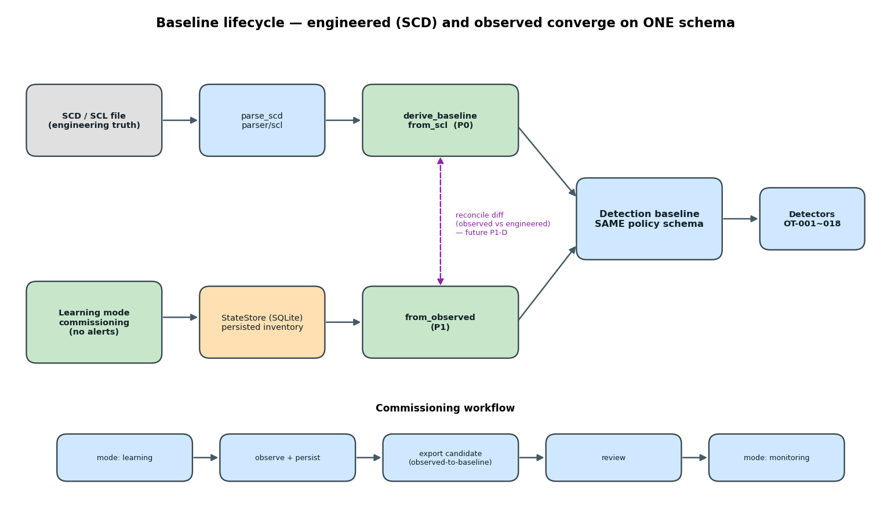

# first-principles-redesign — 從第一性原理重做 baseline

> 分支：`first-principles-redesign`（建立在 `hardening-v1` 之上）
> 一句話：把偵測 baseline 從「手寫猜測」升級成「對照工程真相」，並讓感測器在**還沒有 baseline 時就能安全上線**。

本分支包含 `hardening-v1` 的全部內容（見 [hardening-v1.md](hardening-v1.md)），再加上下述兩階段重做。

## 第一性原理：問題出在哪

這個產品的本質工作：在電廠/變電所**被動、唯讀、不干擾**地、在**便宜硬體上 24/7**偵測異常、留可信證據、送中央平台；電驛/IED 場景代表**漏報/誤報的代價是物理性的**。

由此看出原設計最根本的錯配：**baseline 是手寫 JSON（一份會與現場漂移的猜測），且偵測狀態全在記憶體（重啟即失憶、告警風暴）。** 本分支先解這兩件事，因為它們槓桿最高、且**完全被動、可離線**。

> 完整的第一性原理拆解（含尚未動工的 P0「擷取熱路徑移出 Python」、事件傳輸改佇列、感測器硬化等）見本檔末「Roadmap」。

## Baseline 生命週期



**核心設計**：兩條源頭——工程的 SCD、觀測的學習——**產出同一個 policy schema**，detector 完全不需改動；等真實 SCD 到了，兩者可做 reconcile diff。

---

## P0 — 從 SCD/SCL 自動推導 baseline

對照變電所的**工程真相**，而非手寫。

```bash
python3 scripts/scd-to-baseline.py lab/61850/sample.scd --stdout     # 預覽
make scd-baseline SCD=substation.scd                                 # 寫入 baseline.json
```

- `parser/scl/scd.py`：解析 IED 盤點/IP/GOOSE control block，命名空間相容 2003/2007。
- `policy/from_scl.py`：產出既有 schema。
- **關鍵正確性**：SCL 的 `GSE/MAC-Address` 是 GOOSE **目的多播 MAC**，不是發佈者來源 MAC。若拿它當 match key 會把真實 IED 誤判成 rogue。故以 **APPID** 為權威 key（SCD 與線上封包都一致），`publisher_mac` 留空。
- APPID 依 IEC 61850-6 以 hex 解析（`--appid-base`）；OT-017 `max_silence_sec` 由 GSE `MaxTime` × 係數推導。
- 產出通過 `validate_policy`，並對缺 APPID／超範圍／缺 IP 告警。

## P1 — Commissioning（學習模式）+ 狀態持久化

**還沒有 SCD 時**，讓感測器先安靜地觀測學習：

```yaml
# config/sensor.yaml
detection:
  mode: learning                               # 只觀測、不告警
  state_db: /app/data/assets/learned-state.db  # 學到的盤點落地，重啟不失憶
```

跑一段代表性時間後，匯出候選 baseline 審核，再切回 `monitoring`：

```bash
python3 scripts/observed-to-baseline.py data/assets/learned-state.db --stdout
make observed-baseline DB=data/assets/learned-state.db
```

- **狀態持久化**（`assets/store.py`，SQLite）：known macs/ips/pairs/ports、mac↔ip、GOOSE、MMS pairs 落地 → **重啟不再告警風暴**。
- **learning 模式**：evaluator 照常更新學到的狀態，但 pipeline `_emit` 抑制所有告警（單一節點）。
- **候選 baseline**（`policy/from_observed.py`）：觀測能拿到 GOOSE **來源 MAC**，故以 `(publisher_mac, APPID)` 為 key；MMS IED + 允許 client 由觀測配對推得。與 SCD 產出**同一 schema**。

## 兩條源頭的會合（reconcile，未來 P1-D）

等真實 SCD 到了，diff「觀測 vs 工程」：
- 觀測到但不在 SCD ＝ 可疑/誤設。
- 在 SCD 但從沒觀測到 ＝ 設備缺失。
- 這個 diff 本身就是高價值告警，也是兩套 baseline 的最終會合點。

---

## 狀態：已做 vs 提案

| 項目 | 狀態 |
|------|------|
| P0 SCD/SCL 攝取 + 推導 + CLI | ✅ 已實作 + 測試 |
| P1 狀態持久化（消除重啟風暴） | ✅ 已實作 + 測試 |
| P1 commissioning 學習模式 | ✅ 已實作 + 測試 |
| P1 候選 baseline 匯出 | ✅ 已實作 + 測試 |
| P1-D reconcile（observed ↔ SCD diff） | ⏳ 提案（等真實 SCD） |
| 擷取熱路徑移出 Python（AF_PACKET/eBPF） | ⏳ 提案（吞吐天花板） |
| 事件傳輸改走 SQLite/MQTT 佇列（丟 JSONL-IPC） | ⏳ 提案 |
| 感測器硬化（去 docker.sock、drop caps、mTLS） | ⏳ 提案 |
| 標註 pcap 語料庫評測 precision/recall | ⏳ 提案 |

> 已實作項目全部**向後相容**（`state_db` 空、`mode: monitoring` 為預設）、**opt-in**、且不改 detector 與上傳鏈。

## 驗證

```bash
make test                       # 全套件（含 SCD、persistence、learning、observed 測試）
python3 scripts/scd-to-baseline.py lab/61850/sample.scd --stdout
```

## 變更檔案速覽（相對 hardening-v1）

- SCD：`parser/scl/scd.py`、`policy/from_scl.py`、`scripts/scd-to-baseline.py`、`lab/61850/sample.scd`
- 持久化/學習：`assets/store.py`、`policy/from_observed.py`、`scripts/observed-to-baseline.py`、`pipeline/processor.py`（`_emit` 抑制 + store 載入/存檔）、`config/settings.py`（`mode`/`state_db`）
- 測試：`tests/unit/test_{scl_parser,baseline_from_scl,state_store,learning_mode,baseline_from_observed}.py`
