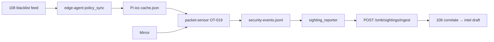

# OT Lab 一鍵部署 Runbook（OT-B4）

三節點 lab 拓撲：

| 節點 | IP | 角色 | SSH |
|------|-----|------|-----|
| Pi 4 | 192.168.1.124 | EdgeX + packet sensor + SenseL agent（CTA PoC 主 Edge） | `edgex` / `edgex` |
| Pi 4（legacy） | 192.168.1.123 | 舊 Sprint lab Edge | `edgex` / `edgex` |
| Mac CP | 192.168.1.203 | EMQX + Layer A/B/C dataplane | `avocado.ai` / `avocado@@` |
| VM SenseL | 192.168.1.108 | Portal + OT ingest API | `ubuntu` / `avocado@@` |

共用 secret：`OT_SECURITY_INGEST_SECRET=sensel-ot-ingest-lab-2026`

## 前置

```bash
brew install sshpass   # macOS
export SSHPASS='avocado@@'
export OT_REGISTRATION_TOKEN='<Avocado AI 企業邀請碼>'   # Pi 綁 tenant 用
```

三個 repo 需在同一父目錄：

```
~/guacamole-ai
~/Aristaconnector-Control-Plane
~/sensel-ot-edge-sensor
```

## 一鍵部署（全部）

```bash
cd sensel-ot-edge-sensor
chmod +x scripts/deploy-ot-lab.sh scripts/verify-sprint4-lab.sh
cp .env.lab.example .env.lab   # 填 PORTAL_EMAIL / PORTAL_PASSWORD
export SSHPASS='avocado@@'
export OT_REGISTRATION_TOKEN='<Avocado AI 企業邀請碼>'
./scripts/deploy-ot-lab.sh --sprint4   # S5-G1：三節點 deploy + 全綠 gate
```

僅跑 Sprint 4 驗收（不 deploy）：

```bash
export SSHPASS='avocado@@'
./scripts/deploy-ot-lab.sh --verify-sprint4
# 或
./scripts/verify-sprint4-lab.sh --expect-llm
```

順序：**108 SenseL → 203 Layer A/C → Pi edge → S5-G1 驗收**

## 分段部署

```bash
./scripts/deploy-ot-lab.sh --108-only   # SenseL + alembic
./scripts/deploy-ot-lab.sh --203-only   # EMQX + Layer B/C（含 OT-B3 profile）
./scripts/deploy-ot-lab.sh --pi-only    # Pi full stack
./scripts/deploy-ot-lab.sh --verify     # 只跑 Layer C E2E
./scripts/deploy-ot-lab.sh --verify-track-b   # Track B E2E（B-S4）
./scripts/deploy-ot-lab.sh --track-b      # 部署後加跑 Track B E2E
./scripts/deploy-ot-lab.sh --sprint4      # S5-G1：deploy + Sprint4 gate
./scripts/deploy-ot-lab.sh --verify-sprint4
```

## 手動部署（各 repo）

### 108 — SenseL / Portal

```bash
cd guacamole-ai
export DEPLOY_SSH_HOST=192.168.1.108 DEPLOY_SSH_USER=ubuntu SSHPASS='avocado@@'
export DEPLOY_REMOTE_REPO_DIR=/home/ubuntu/guacamole-ai
export DEPLOY_COMPOSE_SERVICES="postgres redis api"
export DEPLOY_WITH_INVESTIGATION=auto   # SMB 調查 + layerc-mvp-ui（若 .env 已啟用）
export DEPLOY_WITH_EDR=1                # Wazuh 端點防護（EDR / 調查所需）
./scripts/deploy_docker_compose.sh
```

**SMB 調查 / 端點防護故障排除：**

若 Portal 顯示「無法連線端點防護後端（Wazuh）」或調查分頁錯誤：

```bash
# 一鍵修復（108 lab）
SSHPASS='avocado@@' DEPLOY_SSH_HOST=192.168.1.108 DEPLOY_SSH_PORT=22 \
  ./scripts/enable_investigation_layerc_remote.sh
```

確認：
- `SMB_INVESTIGATION_ENABLED=true`
- `LAYERC_MVP_UI_URL=http://layerc-mvp-ui:8000`（Docker 內網，**勿**指向 203:8000）
- 容器 Up：`wazuh-manager`、`wazuh-indexer`、`layerc-mvp-ui`
- 主機埠：`layerc-mvp-ui` 預設 **8002**（避免與本機 uvicorn :8000 衝突）

### 203 — Control Plane Layer A + C

```bash
cd Aristaconnector-Control-Plane
export SSHPASS='avocado@@'
export CONTROL_PLANE_BASE_URL=http://192.168.1.108:8081
export OT_SECURITY_INGEST_SECRET=sensel-ot-ingest-lab-2026
./scripts/deploy-layerA-remote.sh avocado.ai@192.168.1.203
```

OT-B3 關鍵 env（`docker-compose.layerc.yml`）：

- `LAYERC_OT_ANALYZE_PROFILE=1`
- `LAYERC_BRIDGE_MODE=live`
- `AGENT_MODE=rule`
- OT episode → `evidenceops=false`，不走 Wazuh

Sprint 4 LLM enrich（POC，預設關閉）：

- `OT_LLM_ENRICH=1` — 啟用 episode 級 gemma2:2b 摘要
- `OT_LLM_MODEL=gemma2:2b`
- `OT_LLM_MAX_TOKENS=512`
- `ollama pull gemma2:2b`（203 host 本機 Ollama，非 remote GPU）
- E2E：`python3 scripts/e2e-ot-layerc-analyze.py --expect-llm`（需 enrich 開啟）

Sprint 4 Layer B AE：

- `OT_BEHAVIOR_AE_ENABLED=1` — 啟用 behavior_score 寫入 entity_state
- 模型 artifact：`models/ot_behavior_ae/v1/model.joblib`（`scripts/train_ot_behavior_ae.py`）
- Lab 一鍵：`./scripts/deploy-ot-lab.sh --sprint4`（含 LLM E2E gate）

### Pi — Edge Sensor

```bash
cd sensel-ot-edge-sensor
export SSHPASS='edgex'   # Pi 預設密碼
export OT_REGISTRATION_TOKEN='<invite-code>'   # 或於 Edge Console UI 設定
./scripts/deploy-pi-full.sh edgex@192.168.1.123
```

**Edge Console（推薦）：** `http://192.168.1.123:8090` — 設定精靈填寫企業邀請碼並註冊。強制重新整理：`Ctrl+Shift+R`。

### Edge Console 功能地圖（SenseL EdgeX）

| 分頁 | 用途 |
|------|------|
| 總覽 | Telemetry 趨勢圖、Policy 合規 gauge、註冊/MQTT/Baseline 狀態 |
| EdgeX 平台 | core-data/metadata、device 服務、重啟 |
| 設備與協定 | 被動發現（Mirror IP）、**＋ 新增設備**、OPC UA/S7 Phase2 |
| 安全事件 | Rule、**來源 IP / 關聯設備** |
| 即時流量 | Mirror pkt/s、GOOSE/MMS |
| 進階 | 擷取 BPF、Console 密碼、**審計 log** |

```bash
# Console smoke
EDGE_CONSOLE_URL=http://192.168.1.123:8090 ./scripts/verify-edge-console-edgex.sh
EDGE_CONSOLE_URL=http://192.168.1.123:8090 ./scripts/verify-edge-console-traffic.sh
```

正式部署請設 `EDGE_CONSOLE_PASSWORD` 並使用 `docker-compose.pi-production.yml`。

### S5-F1 Pi：開機順序、healthcheck、`.env` 保留（階段 4）

| 機制 | 說明 |
|------|------|
| `scripts/wait-for-upstream.sh` | 啟動前等待 203:1883 + 108 `/api/health`（`WAIT_UPSTREAM=0` 可略過） |
| `docker-compose.pi-reliability.yml` | `edge-agent` / `edge-console` / `packet-sensor` healthcheck |
| `scripts/seed-pi-env.sh` | 僅補缺 key，**不覆寫**既有 `.env` / `platform.json` |
| `scripts/pi-stack-up.sh` | Pi 本機一鍵：seed → wait → compose up → EdgeX 61850 apply → health gate |
| `scripts/verify-pi-stack-health.sh` | 驗證三服務 `healthy` + `agent-runtime.json` |

```bash
# Pi 上（已同步 repo 後）
cd ~/sensel-ot-edge-sensor
./scripts/pi-stack-up.sh

# 或僅驗證 health
make verify-pi-health

# systemd 開機自啟（可選）
sudo cp deploy/systemd/sensel-edge-stack.service /etc/systemd/system/
sudo systemctl enable --now sensel-edge-stack.service
```

`deploy-pi-full.sh` 已改為 **merge `.env`**，不再整檔覆寫。

### Lab 流量 UI 控制（P0）

在 `:8090` → **即時流量** 分頁可開始／暫停 GOOSE/MMS 模擬與 packet-sensor；API 見 [edge-console-lab-traffic-control.md](edge-console-lab-traffic-control.md)。

```bash
EDGE_CONSOLE_URL=http://192.168.1.123:8090 ./scripts/verify-edge-console-lab-traffic.sh
```

## E2E 驗證

### Layer C analyze（OT profile）

```bash
cd Aristaconnector-Control-Plane
PYTHONPATH=. python3 scripts/e2e-ot-layerc-analyze.py --layerc-url http://192.168.1.203:8001
```

預期輸出：

```json
{
  "ok": true,
  "status": "ok",
  "evidenceops": false,
  "c2_mode": "ot_security_profile"
}
```

### 端到端資料流

1. Pi 產生 OT 規則事件 → MQTT `192.168.1.203:1883`
2. mqtt-bridge → Redpanda → Layer B episode
3. layerc-bridge → `/analyze`（OT profile）→ writeback → 108 ingest
4. Portal **工控安全防護** 可見事件與 Layer C 摘要

## CTA PoC 部署（Continuous Trust Assurance）

完整設計與驗證紀錄見 [`continuous-trust-assurance-poc.md`](continuous-trust-assurance-poc.md) §9.14。

**禁止**僅 `docker cp` / 手動 rsync 單檔到 `.108`；應走各 repo 正式 deploy 腳本（含 SMB portal `npm run build`）。

### 一鍵（CTA lab）

```bash
cd sensel-ot-edge-sensor
export SSHPASS='avocado@@'
export OT_REGISTRATION_TOKEN='<invite-code>'   # 可選
export TENANT_ID='company-a9ae1234648ee138'
PI_TARGET=edgex@192.168.1.124 ./scripts/deploy-ot-lab.sh --cta
```

順序：**108 SenseL → 203 Layer A/C + aggregator → Pi .124 → CTA verify**

僅驗收（不 deploy）：

```bash
export SSHPASS='avocado@@'
./scripts/deploy-ot-lab.sh --verify-cta
# 或
./scripts/verify-cta-lab.sh
```

### 分段（手動）

| 步驟 | 主機 | 命令 |
|------|------|------|
| 1 | `.108` | `cd guacamole-ai && DEPLOY_SSH_HOST=192.168.1.108 DEPLOY_SSH_USER=ubuntu SSHPASS='...' ./scripts/deploy_docker_compose.sh` + `alembic upgrade head` |
| 2 | `.203` | `cd Aristaconnector-Control-Plane && SSHPASS='...' ./scripts/deploy-layerA-remote.sh avocado.ai@192.168.1.203` |
| 3 | `.124` | `cd sensel-ot-edge-sensor && SSHPASS='edgex' ./scripts/deploy-pi-full.sh edgex@192.168.1.124` |

### CTA 關鍵 env

| 主機 | 變數 | Lab 值 |
|------|------|--------|
| `.203` | `CTA_COVERAGE_GROUP_ID` | `cta-coverage-aggregator-v3` |
| `.203` | `CTA_COVERAGE_BOOTSTRAP_SNAPSHOT` | `1`（重启读 `{tenant}.state.json`） |
| `.203` | `outputs` mount | **RW**（写 `{tenant}.json` + `{tenant}.state.json`；禁止 `:ro` overlay） |
| `.203` | `LAYERC_EVENTS_SOURCE` | `auto`（无 Wazuh 时 `/api/layerc/events` 读 `layerc_bridge/`） |
| `.108` | `LAYERC_API_URL` | `http://192.168.1.203:8001`（或 auto-discover） |
| `.108` | `TZ` | `Asia/Taipei` |

### 驗收預期

- `curl http://192.168.1.203:8001/api/cta/coverage?tenant_id=company-a9ae1234648ee138` → `summary.fully_covered >= 1`
- `curl http://192.168.1.203:8001/api/layerc/events?limit=5` → 200（filesystem fallback）
- `docker restart layera-cta-coverage-aggregator` 后 30s 内 `fully_covered` 应维持（state bootstrap）
- Portal → **工控安全防護 → CTA 覆蓋率** 熱圖與 gap 清單

SSH 到 `.203` Mac 若 key 衝突：`ssh -o PreferredAuthentications=password -o PubkeyAuthentication=no avocado.ai@192.168.1.203`

### Portal Layer C 驗收（S5-E1）

需 Portal 使用者 JWT（M2M ingest key 無法呼叫 SMB `/ot-security/*`）：

```bash
export PORTAL_BEARER_TOKEN='...'   # 或 PORTAL_EMAIL + PORTAL_PASSWORD
export WORKSPACE_ID=6
./scripts/verify-portal-layerc.sh --expect-llm
```

匯出 LLM 人工評分樣本（S5-E2）：

```bash
./scripts/verify-portal-layerc.sh --export-json docs/llm-eval-samples.jsonl --expect-llm
```

評分表：[`docs/sprint-4-llm-eval.md`](sprint-4-llm-eval.md)

### Sprint 4 一鍵驗收（S5-G1）

整合 108 / 203 / Pi smoke、Layer C analyze、Portal Layer C 卡片：

```bash
cp .env.lab.example .env.lab
# 編輯 .env.lab：PORTAL_EMAIL、PORTAL_PASSWORD、WORKSPACE_ID=6

export SSHPASS='avocado@@'
./scripts/deploy-ot-lab.sh --verify-sprint4
# 或 deploy + gate：
./scripts/deploy-ot-lab.sh --sprint4
```

Gate 檢查項：

| 檢查 | 內容 |
|------|------|
| G1-108 | `GET /api/health` |
| G1-203 | `GET :8001/health` |
| G1-203-F1 | `layerc-api` + `layerb-worker` docker health=healthy（S5-F1） |
| G1-Pi | `sensel-edge-agent` 運行 + `security-events.jsonl` 非空 |
| G1-LayerC | `e2e-ot-layerc-analyze.py --expect-llm` |
| G1-Portal | `verify-portal-layerc.sh --expect-llm` |

### S5-F1：203 healthcheck + restart policy

`layerc-api` 與 `layerb-worker` 已設定 Docker healthcheck；`layerc-bridge` / `layerb-wazuh-bridge` 以 `service_healthy` 等待上游。

```bash
export SSHPASS='avocado@@'
chmod +x scripts/verify-203-compose-health.sh
./scripts/verify-203-compose-health.sh
```

重 deploy 203：`./scripts/deploy-ot-lab.sh --203-only`

4. Portal「工控安全防護」可見事件、Layer C reasoning、感測器列表

### Track B-S2：IoC 匹配驗收

Pi `.env` 或 Edge Console `platform.json` 需設定：

```bash
SMB_INTEL_API_KEY=<Portal 情資 API Key>
POLICY_SYNC_TENANT_ID=sensel-platform   # 若 Key 綁定平台 tenant
```

1. 確認 edge-agent 已寫入快取：

```bash
ssh edgex@192.168.1.123 'jq .item_count,data/agent/ioc-cache.json 2>/dev/null || ls -la data/agent/ioc-cache.*'
```

2. 確認 packet-sensor 載入（log 應有 `IoC cache loaded`）：

```bash
ssh edgex@192.168.1.123 'docker logs sensel-packet-sensor 2>&1 | grep -i ioc | tail -5'
```

3. 在 Portal 新增測試 IPv4 至 blacklist，或 mirror 流量含已知 IoC，檢查 OT-019：

```bash
ssh edgex@192.168.1.123 'grep OT-019 data/assets/security-events.jsonl | tail -3'
```

預期事件：`rule_id=OT-019`、`event_type=CTI_IOC_OBSERVED`、`evidence.ioc_value` 為命中 IP。

### Track B-S3：Sighting 回報驗收

edge-agent 會將 OT-019 事件 POST 至 108：

```bash
ssh edgex@192.168.1.123 'docker logs sensel-edge-agent 2>&1 | grep -i sighting | tail -5'
curl -s "http://192.168.1.108:8081/api/v1/smb/sightings/summary" \
  -H "X-API-Key: <SMB_INTEL_API_KEY>"
```

預期 log：`Sighting ingested event=... sighting_id=... matched=...`

失敗時檢查佇列：

```bash
ssh edgex@192.168.1.123 'sudo cat ~/sensel-ot-edge-sensor/data/agent/sighting-queue.jsonl 2>/dev/null | tail -2'
```

### Track B-S4：Lab E2E + correlate 驗收

Track B 閉環驗收標準（B-1～B-6）：

| # | 步驟 | 預期 |
|---|------|------|
| B-1 | 108 feed 含測試 IP | 60s 內 Pi `ioc-cache.json` 有對應 ipv4 |
| B-2 | mirror 流量命中 IoC | JSONL 出現 `OT-019` |
| B-3 | edge-agent sighting reporter | 108 有 `ndr` / `cti_ioc_observed` sighting |
| B-4 | intel correlate | `matched_intel_id` 有值（需 seed 或 Portal 核准 IoC） |
| B-5 | cooldown | 同 IoC 不重複 spam（抽樣檢查） |
| B-6 | 108 斷線 | `sighting-queue.jsonl` 持久化，恢復後補送 |

**一鍵 E2E：**

```bash
export SMB_INTEL_API_KEY='<Portal 情資 API Key>'
export POLICY_SYNC_TENANT_ID=sensel-platform
export SSHPASS='edgex'   # Pi SSH

# 可選：在 108 建立可 correlate 的核准 IoC（預設 203.0.113.99）
export SSHPASS='avocado@@'
./scripts/seed-track-b-lab-ioc.sh

# 基本驗證（feed / cache / OT-019 / sightings）
./scripts/verify-track-b-e2e.sh

# 含 correlate 驗證（需先 seed 或 Portal 核准同 IP）
TRACK_B_PROBE_IP=203.0.113.99 ./scripts/verify-track-b-e2e.sh --expect-correlate --probe-ip 203.0.113.99
```

**Lab mirror 實際 IP（MMS 來源 192.168.10.88）端到端：**

```bash
# seed 實驗室 mirror IP，等 policy_sync 60s 或 restart edge-agent
TRACK_B_TEST_IOC_IP=192.168.10.88 SSHPASS=avocado@@ ./scripts/seed-track-b-lab-ioc.sh

# Pi 上應持續產生 OT-019（已有 MMS 流量）→ sighting → correlate
TRACK_B_TEST_IOC_IP=192.168.10.88 TRACK_B_PROBE_IP=192.168.10.88 \
  ./scripts/verify-track-b-e2e.sh --expect-correlate --probe-ip 192.168.10.88
```

**deploy-ot-lab 整合：**

```bash
./scripts/deploy-ot-lab.sh --verify-track-b
./scripts/deploy-ot-lab.sh --track-b   # full deploy + Track B gate
```

### Track B-S5：MQTT blacklist 訂閱

108 policy 週期（或手動 publish）將 artifact 推至 EMQX topic：

`sensel/{tenant_id}/policy/blacklist`

Pi edge-agent 設：

```bash
POLICY_SYNC_MQTT_ENABLED=true
POLICY_SYNC_MQTT_HOST=192.168.1.203
POLICY_SYNC_MQTT_PORT=1883
# topic 內 tenant 使用 POLICY_SYNC_TENANT_ID（例：sensel-platform）
```

**Lab 驗證：**

```bash
# 1) 確認 Pi 已訂閱
ssh edgex@192.168.1.123 'grep POLICY_SYNC_MQTT ~/sensel-ot-edge-sensor/.env; docker logs sensel-edge-agent 2>&1 | grep -i "Policy MQTT" | tail -3'

# 2) 從本機 publish（拉 108 feed 或 inline）
export SMB_INTEL_API_KEY='<Portal 情資 API Key>'
chmod +x scripts/publish-track-b-lab-blacklist-mqtt.sh
./scripts/publish-track-b-lab-blacklist-mqtt.sh --bump

# 3) 確認 Pi cache 版本更新
ssh edgex@192.168.1.123 'docker logs sensel-edge-agent 2>&1 | grep "Policy MQTT applied" | tail -3'
ssh edgex@192.168.1.123 'docker exec sensel-edge-agent cat /app/data/ioc-cache.json | python3 -c "import json,sys; d=json.load(sys.stdin); print(d.get(\"artifact_version\"), d.get(\"item_count\"))"'
```

HTTP pull（B-S1）仍為備援；MQTT 與 HTTP 以 etag 去重，不重複寫入。

### Track A：AF_XDP 加速擷取

Pi packet-sensor 以 XDP redirect + AF_XDP 取代 Scapy `sniff()`；attach 失敗自動 fallback Scapy。

**啟用（Lab）：**

```bash
# Pi .env 或 data/agent/capture.env
CAPTURE_BACKEND=af_xdp
XDP_MODE=native          # USB 網卡可改 generic
XDP_QUEUE_ID=0
```

**部署 rebuild：**

```bash
ssh edgex@192.168.1.123 'cd ~/sensel-ot-edge-sensor && \
  grep CAPTURE_BACKEND .env data/agent/capture.env 2>/dev/null; \
  docker compose -f docker-compose.yml -f docker-compose.pi4.yml \
    -f docker-compose.lab-61850.yml -f docker-compose.pi-lab.yml \
    up -d --build packet-sensor'
```

**驗收（A-1～A-4）：**

```bash
# A-1/A-4：backend 與 fallback
ssh edgex@192.168.1.123 'docker logs sensel-packet-sensor 2>&1 | grep -iE "backend=|AF_XDP|fallback" | tail -8'

# A-1：JSONL 仍持續寫入
ssh edgex@192.168.1.123 'tail -3 data/assets/security-events.jsonl'

# stats log 應含 capture_backend=af_xdp（或 scapy 若 fallback）
ssh edgex@192.168.1.123 'docker logs sensel-packet-sensor 2>&1 | grep "Capture stats" | tail -3'
```

| # | 條件 |
|---|------|
| A-1 | `af_xdp` 24h 無 crash，OT 規則事件仍寫 JSONL |
| A-2 | 相同 mirror 下 CPU 下降 ≥30%（vs Scapy baseline） |
| A-3 | XDP stats drop <0.1% @ ≤100 Mbps |
| A-4 | attach 失敗自動 fallback Scapy |

**Pi Lab 備註：** 123 預設 kernel 未開 `CONFIG_XDP_SOCKETS`（`bpftool feature probe kernel` 顯示 `xskmap is NOT available`），無法建立 `xsks_map`；會 fallback Scapy，JSONL 仍正常。要實跑 `af_xdp` 需自訂 kernel 或換支援 AF_XDP 的主機。

**資料流：**



### 健康檢查

```bash
curl -s http://192.168.1.108:8081/api/health
curl -s http://192.168.1.203:8001/health
curl -s http://192.168.1.123:8080   # Pi events viewer (lab profile only)
```

## Production Pi 部署（E3）

現場交付請使用 **production profile**（不含 mock-sensel / events-viewer）：

```bash
./scripts/deploy-pi-full.sh --profile production edgex@192.168.1.123
```

- Edge Console：`http://<pi-ip>:8090`（建議設定 `EDGE_CONSOLE_PASSWORD`）
- 註冊後驗證：`EDGE_CONSOLE_URL=... INVITE_CODE=... SENSEL_API_KEY=... ./scripts/verify-pi-onboarding.sh`
- Production 預設 `MQTT_REQUIRE_TENANT=true`：未完成 Portal 註冊前不會以 `default` tenant 北向 MQTT

進階設定（BPF / 擷取介面）可在 Edge Console「進階」分頁修改，寫入 `data/agent/capture.env` 後重啟 packet-sensor。

## 常見問題

| 症狀 | 處理 |
|------|------|
| Layer C 422 / Wazuh 錯誤 | 確認 `LAYERC_OT_ANALYZE_PROFILE=1`，重建 `layerc-api` + `layerc-bridge` |
| 事件 tenant=default | Pi 設 `OT_REGISTRATION_TOKEN` 後重 deploy |
| 重複事件 | Sprint B upsert 已處理；bridge + writeback 雙 POST 會 dedup |
| 203 docker 找不到 | SSH 後加 PATH：`export PATH="/Applications/Docker.app/Contents/Resources/bin:$PATH"` |
| Track B feed 無 IPv4 | 執行 `./scripts/seed-track-b-lab-ioc.sh` 或 Portal 核准帶 `taiwan-supply-chain` tag 的 IoC |
| sighting matched=false | IoC draft 需與 sighting `value` 完全一致；先 seed 再 `--expect-correlate` |
| OT-019 無事件 | 確認 feed/cache 含 mirror 流量 IP；檢查 `IOC_MATCH_ENABLED` 與 `OT-019` 在 rules_enabled |
| MQTT cache 不更新 | 確認 `POLICY_SYNC_MQTT_ENABLED=true`、203 :1883 可達、topic tenant 與 `POLICY_SYNC_TENANT_ID` 一致 |
| AF_XDP fallback scapy | 查 log `xdp_cap_open failed`；Pi 預設 kernel 常缺 `CONFIG_XDP_SOCKETS`（`bpftool feature probe kernel`）；試 `XDP_MODE=generic`；確認 `/sys/fs/bpf` 已掛載 |

## Git 分支對照

| Repo | Branch | Sprint |
|------|--------|--------|
| guacamole-ai | `SenseL-Guardian` | A + B（Portal、ingest、sensor） |
| Aristaconnector-Control-Plane | `ot` | B3（Layer C OT profile） |
| sensel-ot-edge-sensor | `main` | Edge MVP + Pi deploy |
