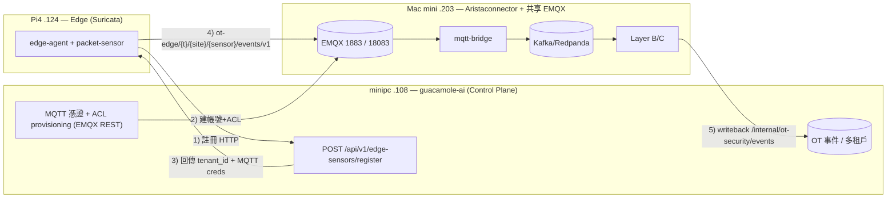

# Runbook — 共享 EMQX 串接三層(Edge + Control Plane + Data/Inference)

把 **edge sensor / 控制平面 / 資料-推論平面** 透過**一個共享 EMQX**串成端到端鏈路的
實機 onboarding 步驟、可行性評估與驗收測試。

## 拓撲與角色

| 主機 | IP | 元件 | 角色 |
|------|----|------|------|
| Pi4 | `192.168.1.124` | `sensel-ot-edge-sensor`（**Suricata** 引擎） | Edge Runtime：擷取、偵測、北向發佈 |
| minipc | `192.168.1.108` | `guacamole-ai` | **Control Plane**：裝置註冊 / MQTT 憑證·ACL provisioning / 偵測政策 / 多租戶 / OT 事件儲存 |
| Mac mini | `192.168.1.203` | `Aristaconnector-Control-Plane`（Layer A/B/C）+ **共享 EMQX** | Data + Inference：MQTT→Kafka ingest → ET-BERT/規則推論 → Wazuh/RAG 調查 → writeback |

> ⚠️ Pi4 是 ARM64：只能用 **Suricata**（`jasonish/suricata` 為 multi-arch），
> **不可用 Snort**（`ciscotalos/snort3` 僅 amd64）。

### 資料流



---

## 可行性評估

**結論:可行(Lab/PoC 等級)**,前提是把三邊都指向**同一個 EMQX(.203)**,並手動替 bridge
建一個服務帳號。Suricata 對結論無影響。

### 先決條件 / 檢查項

| 項目 | 要求 | 風險 / 備註 |
|------|------|------------|
| 網路 | 三機同網段 `192.168.1.0/24` 互通 | 開放 `.203:1883`(MQTT，給 Pi4 與 bridge)、`.108→.203:18083`(EMQX REST，給 provisioning) |
| 單一 broker | **只跑一個 EMQX**(在 .203) | 不要同時啟用 guacamole-ai 自帶 broker 當 provisioning 目標；全部指 `.203` |
| EMQX 認證模式 | built-in DB authn + authz、`no_match=deny`、關 cache | 設錯 → deny-by-default 會**靜默丟棄**所有遙測 |
| bridge 服務帳號 | 需可 `subscribe ot-edge/#` 的帳號 + ACL | guacamole-ai 只發**每 sensor** 帳號;bridge 帳號要**手動建**(見步驟 2c) |
| 租戶綁定 | edge 必須先註冊取得 `tenant_id`(非 `default`)才會發佈 | `MQTT_REQUIRE_TENANT=true` 時，未綁租戶不發事件 |
| Pi4 引擎 | Suricata(arm64) | Snort 不可在 Pi4 原生跑 |
| guacamole-ai API port | 確認控制平面對外 API 連接埠 | 下方以 `:PORT` 表示，請替換實際值 |

### 不在本 runbook 範圍
- 生產級 TLS(8883/WSS)、EMQX 叢集、Kafka 持久化調校。
- Aristaconnector Layer B/C 的模型與 Wazuh 設定(沿用其自身文件)。

---

## Onboarding 步驟

### 變數約定（先 export，方便複製貼上）

```bash
EDGE_IP=192.168.1.124          # Pi4
CP_IP=192.168.1.108            # guacamole-ai (minipc)
DP_IP=192.168.1.203            # Aristaconnector + EMQX (Mac mini)
EMQX_KEY=sensel-prov-key
EMQX_SECRET=sensel-prov-secret-please-change
```

### 步驟 1 — 在 .203 啟動共享 EMQX(含 REST API key)

沿用 Aristaconnector Layer A 的 EMQX,並注入 bootstrap API key 供 guacamole-ai 佈建。

```bash
# 於 Mac mini (.203)
mkdir -p ~/sensel-emqx && printf '%s:%s:administrator\n' "$EMQX_KEY" "$EMQX_SECRET" \
  > ~/sensel-emqx/api-keys.txt

# 若用 Aristaconnector layerA compose：在 emqx 服務加上
#   environment: EMQX_API_KEY__BOOTSTRAP_FILE=/opt/emqx/etc/api-keys.txt
#   volumes:     ~/sensel-emqx/api-keys.txt:/opt/emqx/etc/api-keys.txt:ro
#   ports:       "1883:1883" 與 "18083:18083" 對 LAN 開放(0.0.0.0)
cd /path/to/Aristaconnector-Control-Plane/sensel-dataplane/deployments/layerA
docker compose up -d emqx redpanda
```

驗證 REST 可達(從 .108)：

```bash
curl -fsS -u "$EMQX_KEY:$EMQX_SECRET" http://$DP_IP:18083/api/v5/status && echo OK
```

### 步驟 2 — EMQX 一次性 bootstrap（authn / authz / deny + bridge 帳號）

設 `EMQX=http://$DP_IP:18083`。完整說明見 guacamole-ai `docs/OT_MQTT_PROVISIONING.md`。

**2a. built-in DB 密碼認證**
```bash
curl -u "$EMQX_KEY:$EMQX_SECRET" -X POST "http://$DP_IP:18083/api/v5/authentication" \
  -H 'Content-Type: application/json' -d '{
    "mechanism":"password_based","backend":"built_in_database",
    "user_id_type":"username",
    "password_hash_algorithm":{"name":"sha256","salt_position":"suffix"}}'
```

**2b. built-in DB 授權 + 刪除預設 file source + deny-by-default**
```bash
curl -u "$EMQX_KEY:$EMQX_SECRET" -X POST "http://$DP_IP:18083/api/v5/authorization/sources" \
  -H 'Content-Type: application/json' -d '{"type":"built_in_database","enable":true}'
curl -u "$EMQX_KEY:$EMQX_SECRET" -X DELETE "http://$DP_IP:18083/api/v5/authorization/sources/file"
curl -u "$EMQX_KEY:$EMQX_SECRET" -X PUT "http://$DP_IP:18083/api/v5/authorization/settings" \
  -H 'Content-Type: application/json' -d '{
    "no_match":"deny","deny_action":"ignore",
    "cache":{"enable":false,"excludes":[],"max_size":32,"ttl":"1m"}}'
```

**2c. 建立 bridge 服務帳號 + ACL（手動，guacamole-ai 不會發這個）**
```bash
# 帳號
curl -u "$EMQX_KEY:$EMQX_SECRET" -X POST \
  "http://$DP_IP:18083/api/v5/authentication/password_based:built_in_database/users" \
  -H 'Content-Type: application/json' \
  -d '{"user_id":"layera-bridge","password":"bridge-secret-change-me"}'

# ACL：允許訂閱所有租戶的 ot-edge 北向(bridge 是受信任的內部服務)
curl -u "$EMQX_KEY:$EMQX_SECRET" -X POST \
  "http://$DP_IP:18083/api/v5/authorization/sources/built_in_database/rules/users" \
  -H 'Content-Type: application/json' -d '[{
    "username":"layera-bridge",
    "rules":[{"action":"subscribe","permission":"allow","topic":"ot-edge/#"}]}]'
```

### 步驟 3 — 設定 guacamole-ai provisioning（.108 指向 .203 的 EMQX）

於 minipc (.108) 的 `sensel_control_plane/.env`：

```bash
MQTT_PROVISIONING_ENABLED=true
MQTT_BROKER_KIND=emqx
EMQX_API_URL=http://192.168.1.203:18083
EMQX_API_KEY=sensel-prov-key
EMQX_API_SECRET=sensel-prov-secret-please-change
EMQX_AUTHN_ID=password_based:built_in_database
# 回傳給 edge 連線用的 broker 端點(= 共享 EMQX)
MQTT_PUBLIC_HOST=192.168.1.203
MQTT_PUBLIC_PORT=1883
```

重啟控制平面服務使設定生效。

### 步驟 4 — 在 guacamole-ai 建立 company workspace + 邀請碼

1. 建立(或選定)一個 **company workspace**(OT 功能僅 company workspace 可用),確認其
   license `max_ot_sensors >= 1` 且狀態 `active`。
2. 在成員/設定頁產生**企業邀請碼**(registration token)——這把 token 會把 sensor 綁到該租戶。

### 步驟 5 — 設定 Aristaconnector bridge 訂閱 ot-edge

於 .203 的 Layer A bridge 環境(compose/env)：

```bash
MQTT_BRIDGE_MQTT_HOST=emqx                 # compose 內部名稱;或 192.168.1.203
MQTT_BRIDGE_MQTT_PORT=1883
MQTT_BRIDGE_MQTT_USERNAME=layera-bridge
MQTT_BRIDGE_MQTT_PASSWORD=bridge-secret-change-me
# 預設只訂 layera/arista/#;加入 ot-edge/# 才會收 edge 事件
MQTT_BRIDGE_MQTT_TOPIC=layera/arista/#,ot-edge/#
MQTT_BRIDGE_KAFKA_BOOTSTRAP=redpanda:9092
```

重啟 bridge。topic→Kafka 對映已內建(`ot-edge/+/+/+/events/v1 → events.norm.ot_security.v1`)。

### 步驟 6 — 在 Pi4 部署 edge（Suricata）並註冊

於 Pi4 (.124) 的 `.env`(以 `.env.openwrt.example` 為底)：

```bash
SITE_ID=site-pi4-001
SENSOR_ID=ndr-edge-pi4-124
SENSEL_API_URL=http://192.168.1.108:PORT      # guacamole-ai 控制平面 API
SENSEL_API_KEY=<ingest/api key>
OT_REGISTRATION_TOKEN=<步驟4 的企業邀請碼>
NORTHBOUND_MQTT_ENABLED=true
CONTROL_PLANE_MQTT_HOST=192.168.1.203          # 共享 EMQX（先用此值;註冊回應會覆寫）
CONTROL_PLANE_MQTT_PORT=1883
MQTT_REQUIRE_TENANT=true                        # 未綁租戶不發事件
CAPTURE_INTERFACE=eth1                          # 鏡像埠(USB Ethernet)
```

啟動(含 Suricata overlay 與 Pi4 資源限制)：

```bash
SURICATA_INTERFACE=eth1 \
docker compose -f docker-compose.yml -f docker-compose.pi4.yml \
  -f docker-compose.suricata.yml up -d
```

開 Edge Console `http://192.168.1.124:8090` → 接入精靈填身分/SenseL/邀請碼 → **儲存並註冊**。
註冊成功後「落地狀態」面板會顯示 tenant、MQTT 憑證已落地、Suricata 引擎狀態。

---

## 驗收測試（3 個 Test Cases）

### TC-1 — 裝置註冊 + MQTT 憑證/ACL provisioning

**目的**:驗證 edge 能向 guacamole-ai 註冊,並由控制平面把帳號+ACL 推進共享 EMQX。

**步驟**
1. 在 Pi4 完成步驟 6 的「儲存並註冊」。
2. 看 Edge Console「落地狀態」:MQTT 憑證 = **✓ 已落地**,顯示 tenant_id。
3. 在 .108 查該 sensor 憑證狀態:
   `GET /api/v1/smb/workspaces/{wid}/ot-security/sensors/{sid}/mqtt-credential` → `status=active`、`provisioned=true`。
4. 在 EMQX 確認帳號存在:
   ```bash
   curl -u "$EMQX_KEY:$EMQX_SECRET" \
     "http://$DP_IP:18083/api/v5/authentication/password_based:built_in_database/users?like_user_id=ndr-edge-pi4-124"
   ```

**通過標準**:註冊回應含 `tenant_id` 與 `mqtt_username/password`;EMQX 查得到該 user;
Console 顯示已落地。**(資料來源:guacamole-ai `routes_ot_edge_sensors.py` register + `mqtt_provisioning`)**

---

### TC-2 — 北向事件流 + ACL 強制(正/負路徑)

**目的**:驗證 Suricata 告警 → edge 發佈 `ot-edge/...` → EMQX → bridge → Kafka,且
deny-by-default ACL 真的隔離跨租戶。

**正路徑**
1. 對 Pi4 鏡像埠灌一筆會觸發 Suricata/OT 規則的流量(例:Modbus TCP 502 連線,
   對應 `config/suricata/rules/local.rules` 的 sid 1000001)。
2. 在 .203 監看 bridge 對應的 Kafka topic:
   ```bash
   docker exec -it <redpanda> rpk topic consume events.norm.ot_security.v1 --num 1
   ```
   應收到一筆,`tenant_id` = 該租戶、`sensor_id=ndr-edge-pi4-124`、`category=ot_security`。

**負路徑(ACL 隔離)**
3. 用該 sensor 的帳密,嘗試發佈到**別的租戶** topic:
   ```bash
   mosquitto_pub -h $DP_IP -p 1883 -u ndr-edge-pi4-124 -P '<secret>' \
     -t 'ot-edge/other-tenant/s/x/events/v1' -m '{}' ; echo "rc=$?"
   ```
   發佈應被 EMQX 拒絕(deny),Kafka **不應**出現該訊息。

**通過標準**:正路徑 Kafka 收到正規化事件;負路徑被拒、無跨租戶外洩。
**(資料來源:edge `northbound/topics.py`;bridge `ot-edge/+/+/+/events/v1` 對映;ACL 表見 OT_MQTT_PROVISIONING.md)**

---

### TC-3 — 端到端進 guacamole-ai OT 事件 + 多租戶可見性

**目的**:驗證事件最終出現在控制平面的 OT 事件清單(經 Layer C writeback 或直送),
且只有該租戶看得到。

**步驟**
1. 沿用 TC-2 產生的事件,等待 Aristaconnector Layer B/C 處理並
   writeback(`POST /api/v1/internal/ot-security/events`)。
2. 在 guacamole-ai SMB Portal 以**該 company workspace** 登入 → 工控安全防護 → 事件:
   應看到對應 sensor 的事件(`rule_id` 為 Suricata/OT 規則 id)。
3. 以**另一個租戶**的 workspace 登入同一畫面:**不應**看到上述事件。

**通過標準**:正確租戶看得到事件;其他租戶看不到(tenant_id 隔離)。
**(資料來源:Aristaconnector `connectors/control_plane_client/ot_security_client.py`;
guacamole-ai `ot_security_routes.py` list events 以 tenant_id 過濾)**

---

## 疑難排解

| 症狀 | 可能原因 | 處理 |
|------|----------|------|
| 註冊失敗 401/404 | `SENSEL_API_URL`/port 錯、邀請碼無效 | 確認 .108 API port 與 workspace 邀請碼 |
| 憑證落地但事件收不到 | ACL publish 前綴不符 / cache 未關 | 確認 `no_match=deny` + `cache.enable=false`;edge 發 `ot-edge/...` |
| bridge 連得上但無訊息 | `MQTT_BRIDGE_MQTT_TOPIC` 未含 `ot-edge/#` 或帳號無 ACL | 補步驟 2c 與 5 |
| edge 不發事件 | `MQTT_REQUIRE_TENANT=true` 但 tenant 仍為 default | 確認註冊成功、tenant 已綁定 |
| Pi4 起不了引擎 | 誤用 Snort(amd64) | 改用 Suricata overlay |
