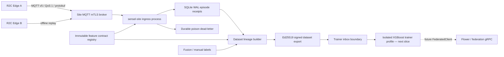

# SenseL P3-A Tier 2 Site Node

P3-A 在 Edge repository 增加獨立部署的 `sensel-site`。它與 R2C Edge Agent 同 repo 管理，但使用不同 image、process、資料 volume 與硬體假設。這一片建立 Site broker ingress、durable episode store、dataset lineage、policy/model cache 及 trainer export boundary；不啟動 Flower、不執行 federated round，也不讓 trainer 存取 Tier 1 runtime。

## Architecture and trust boundaries



| Boundary | P3-A rule |
|---|---|
| MQTT broker | Client certificate required; each Edge certificate CN has one explicitly listed publish topic |
| Site ingress | Topic identity must equal protobuf metadata and configured tenant/site |
| QoS handling | Manual ACK only after episode receipt or poison dead-letter is durable |
| Site database | SQLite WAL, `synchronous=FULL`, idempotency by tenant/site/sensor/episode ID plus payload digest |
| Feature contract | Ingress checks vector length and sequence length; dataset records ID, version and canonical definition SHA-256 |
| Dataset | Deterministic ordering and ID; manifest records sample/episode/sequence/label lineage and retention policy |
| Trainer | Receives signed read-only files only; Site DB、EdgeX、PCAP and Edge Agent data are not mounted |
| Federation | `FederatedClient` is an interface only; no Flower coupling or outbound FL communication in P3-A |

## MQTT ingestion and replay

The subscription is `sensel/{tenant}/{site}/+/episode/v1`, Content Type must be `application/x-protobuf; message=sensel.episode.v1.TrustEpisode`, Payload Format Indicator is `0`, and retained publishes are rejected. The subscriber uses a persistent MQTT v5 session and QoS 1.

| Event | Durable action | ACK |
|---|---|---|
| New valid episode | Insert immutable protobuf receipt | Yes |
| Same ID and same digest | Return duplicate without a second row | Yes |
| Invalid protobuf/scope/contract | Store bounded dead-letter metadata and payload digest | Yes |
| Same ID with different digest | Store conflict dead-letter | Yes |
| SQLite/disk failure | Roll back transaction | No; broker redelivers |

Dead-letter does not retain the poison payload itself, only topic、content type、error and SHA-256. This prevents malformed large messages from becoming a second unbounded payload store.

## Dataset lineage

Every dataset binds:

- tenant、site and Site node identity;
- feature contract ID、version and definition SHA-256;
- label source (`fusion_decision`、`manual` or `unlabeled`) and per-record label reference;
- episode protobuf digest、sensor、asset、sequence reference and deterministic record digest;
- retention class (`training-short=30d`、`research=180d`、`regulated=365d`);
- sample NDJSON digest and explicit `contains_raw_packets=false`.

`fusion_decision` is treated as weak/deterministic labeling, not analyst ground truth. A manual label is append-only and requires actor plus reason. Dataset ID is derived from lineage content, so the same selection is idempotent while any sample、label、contract or policy change yields a different dataset.

The current Trust Episode carries the latest feature vector plus a sequence reference, not the full 60-frame sequence. Therefore P3-A permits XGBoost trainer handoff only. Tiny LSTM remains blocked until a later slice adds verified full-sequence materialization. Isolation Forest remains an Edge-local baseline and is not a federated target.

## Signing and trainer boundary

Dataset exports use Ed25519. The private key must be a non-symlink file with mode `0600` or stricter. Before trainer handoff the boundary verifies:

1. manifest signature and key identity;
2. manifest/sample SHA-256;
3. tenant/site scope;
4. expected feature contract ID and definition digest carried by the signed manifest;
5. absence of raw packet material.

The trainer inbox contains only:

```text
<job-id>/
├── request.json
├── request.sig
├── dataset/
│   ├── manifest.json
│   ├── manifest.sig
│   └── samples.jsonl
└── candidate-outbox/
```

The actual trainer and signed candidate artifact are deliberately deferred. A future trainer process writes only into `candidate-outbox`; a separate validator must verify metrics、model format、feature compatibility and artifact signature before any federation submission or activation.

## Deployment

Copy `.env.site.example` to an ignored `.env.site`, provision the CA/server/client certificates、deployment-specific `site.acl`, and an Ed25519 key owned/readable by container UID `10001`. Then run:

```text
docker compose --env-file .env.site -f docker-compose.site.yml up -d --build
```

The compose profile uses a read-only root filesystem、drops capabilities、sets `no-new-privileges`, and gives only `/var/lib/sensel-site` as persistent writable state. Production startup fails closed when MQTT mTLS material or required scope identity is missing.

## P3-A acceptance and rollback

| Gate | Acceptance |
|---|---|
| Multi-Edge replay | Multiple sensors insert independently; same payload retry is idempotent |
| Poison handling | Invalid payload is durable once and does not cause an infinite broker loop |
| Contract compatibility | Unknown/tampered contract or vector/sequence mismatch cannot enter training data |
| Dataset reproducibility | Same lineage produces the same dataset ID and sample digest |
| Signature | Manifest or sample tampering fails verification |
| Trainer isolation | Inbox contains no SQLite、PCAP or Tier 1 runtime path |
| Safe algorithm boundary | XGBoost accepted; Tiny LSTM and Isolation Forest rejected in P3-A |
| Edge independence | Site outage does not change R2C local detection、spool or EdgeX behavior |

Rollback stops `docker-compose.site.yml`. R2C continues local detection and its existing episode spool retains northbound retries. Site data volumes should be preserved for audit; deleting them is not part of normal rollback.
