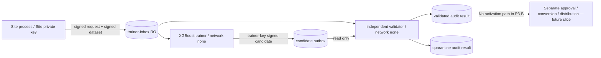

# SenseL P3-B — Isolated XGBoost candidate pipeline

P3-B 在 Tier 2 Site Node 加入本地 XGBoost 訓練，但不加入 federated round，也不允許任何
candidate 自動啟用。輸入、訓練輸出與驗證結果分別位於獨立 volume，trainer 和 validator
皆無網路、無 Site DB、無 EdgeX、無 PCAP、無 MQTT credential。

## Trust boundaries



| Process | Read | Write | Explicitly unavailable |
|---|---|---|---|
| `sensel-site` | Site DB、Site signing key | trainer inbox | candidate / validation volumes |
| `sensel-site-trainer` | trainer inbox、Site public key、trainer private key | candidate outbox | network、Site DB、MQTT、EdgeX、PCAP、validation volume |
| `sensel-site-validator` | trainer inbox、candidate outbox、Site/trainer public keys | validation/quarantine | network、all private keys、Site DB、activation/model distribution |

Validator 會解析可能惡意或損壞的 model，因此刻意不掛載 private key。`validation.json` 與
`validation.sha256` 是隔離 volume 內的 audit record，不是 activation authorization。
未來的核准簽章服務必須是不解析 model 的另一個 process，且不能因 `validated` 狀態自動啟用。

## Immutable contracts

Trainer request 綁定：

- dataset ID、signed sample SHA-256 與 request SHA-256；
- tenant/site、model/base version；
- feature contract ID 與 canonical definition SHA-256；
- XGBoost training policy ID、version 與 definition SHA-256；
- `network_access_required=false`、`automatic_activation_allowed=false`。

`trainer-policy.xgboost-site-v1.json` 固定使用 CPU histogram、single thread、deterministic
seed，並限制 samples、features、dataset bytes、boost rounds 與 model bytes。只接受 policy
明列的 binary positive/negative labels；未知或 unlabeled 樣本會使整個 job fail closed。

Candidate package：

```text
<candidate-volume>/<job-id>/
├── candidate.json
├── candidate.sig
└── model.ubj
```

`candidate.json` 綁定 dataset/request/model/policy provenance、class counts、XGBoost runtime、
train/validation metrics 與 artifact digest。`candidate.sig` 使用獨立 trainer Ed25519 key；Site
dataset key不會提供給 trainer。模型使用 XGBoost 原生 UBJSON，P3-B 不做 ONNX conversion。

## Independent validation and quarantine

Validator 會重新執行，而不是信任 trainer 宣告：

1. 驗證 Site request 與 dataset 的 Ed25519 signature、scope、retention、sample digest；
2. 驗證 trainer candidate signature、artifact size/digest 與 no-activation lifecycle；
3. 重新建立 deterministic train/validation split；
4. 以固定 XGBoost runtime載入 UBJSON，檢查 feature count 與 boost rounds；
5. 重新計算 confusion matrix、accuracy、balanced accuracy、logloss；
6. 比對 signed metrics 並套用 minimum balanced accuracy / maximum logloss gate。

所有 gate 通過才寫入 `validated/<job-id>`；任何 signature、provenance、model parser、metrics 或
policy failure 都寫入 `quarantine/<job-id>`。兩種結果都保存 bounded candidate evidence、
canonical decision 與 SHA-256 audit digest，且固定聲明 `activation.performed=false`。

這裡的 `validated` 只代表模型能重現 signed dataset 上的 metrics 與技術 contract，不代表
OT/醫療場域的 ground-truth efficacy。特別是 `fusion_decision` 屬於 weak label；正式 promotion
仍需要隔離的 curated/time-based holdout、現場 analyst review 與另一個 release approval gate。

## Deployment and operation

除 P3-A secrets 外，需配置：

```text
secrets/site-public/site-signing.pub.pem
secrets/trainer-signing/signing-key.pem       # 0600, trainer UID 10002 readable
secrets/trainer-public/trainer-signing.pub.pem
```

Site key與 trainer key必須不同。先由 Site CLI 建立 signed job，再使用 job ID 執行 one-shot
containers：

```text
make train-site JOB_ID=trainer-<sha256>
make validate-site JOB_ID=trainer-<sha256>
```

Compose 以 `training` profile 啟動 worker；兩者均為 non-root、read-only root filesystem、
`cap_drop=ALL`、`no-new-privileges`、`network_mode=none`。Trainer inbox 對兩個 worker 都是
read-only；candidate volume 對 validator 也是 read-only。預設限制每個 worker 使用 2 CPU、
2 GiB memory 與 256 PIDs，可由 `.env.site` 在部署容量評估後收斂。

## Acceptance and deferred work

| Gate | P3-B acceptance |
|---|---|
| Reproducible input | Signed policy/dataset/request and deterministic stratified split |
| Candidate provenance | Dedicated trainer-key Ed25519 signature and immutable artifact digest |
| Independent verification | Validator recomputes model shape and all signed metrics |
| Tamper response | Modified model/signature/manifest is copied to durable quarantine |
| Isolation | Trainer/validator have no network or Site/Tier 1 state mount |
| No activation | No activation API、volume、DB transition or distribution call exists |

Deferred to later slices：

- UBJSON → ONNX conversion、ONNX parity test、ARM inference benchmark；
- human/Control Plane approval and separately signed release artifact；
- asset-group/time-based holdout、drift/leakage analysis 與 production-grade accuracy policy；
- federation gRPC/protobuf client and central aggregation；
- dataset/candidate/quarantine physical purge worker；
- full sequence materialization required by Tiny LSTM。
