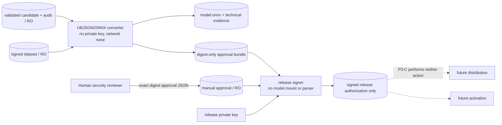

# SenseL P3-C — ONNX technical validation and manual release gate

P3-C 將 P3-B 已驗證的 XGBoost UBJSON candidate 轉為 Edge 可讀的 ONNX，對 asset/time
holdout 執行 prediction parity，並在 ARM64 上量測 inference latency/RSS。技術通過不會自動
release、distribution 或 activation；release 必須由另一個不解析模型的 process，在收到人工
approval 後，以獨立 Ed25519 release key 簽章。

## Trust boundaries



| Process | Model access | Private key | Output |
|---|---|---|---|
| converter | validated UBJSON、generated ONNX | none | ONNX、parity/benchmark evidence、digest-only bundle |
| human reviewer | technical evidence and exact digests | none | one explicit approval JSON |
| release signer | **none**；只掛載 digest-only bundle | release signing key only | signed authorization；不含 model bytes |

Converter 和 signer 均為 one-shot、non-root、read-only root filesystem、`network_mode=none`、
`cap_drop=ALL`。Signer image 不安裝 XGBoost、ONNX、ONNX Runtime 或 `onnxmltools`，也不掛載
candidate、validation、conversion artifact volume。
CI 的 P3 worker job 固定使用 native `ubuntu-24.04-arm` runner；不以 QEMU latency 代替 ARM
performance evidence。

## Holdout and conversion contract

Split strategy 是 `asset-group-latest`：先以各 asset 最後一次 `ended_at` 排序，以最新 asset
cohort 作 validation，並將該 asset 的全部樣本放入同一 cohort。Train/validation asset ID 必須
完全不重疊，兩邊均須符合 class/sample policy。Manifest 保存兩組 asset IDs、time ranges 與
每個 asset 的 latest timestamp，以便 reviewer 檢查 cohort drift 和 leakage。

這不是純粹的 global chronological cutoff；它是「asset-disjoint + latest-asset cohort」holdout。
若部署要求同 asset 的 future-window generalization，需另建第二個純時間 holdout，不能把樣本
同時放進本切片的 asset-disjoint split。

Conversion 固定：

- source：XGBoost 3.1.3 native UBJSON；target：ONNX opset 15；
- input：`features`, float32, `[N, feature_count]`；
- output：index 1 `probabilities`, float32, `[N,2]`，positive class index 1；
- signed feature contract ID/definition SHA-256、candidate/policy/source digests 寫入 ONNX metadata；
- holdout 上比較 XGBoost 與 ONNX Runtime positive probability，套用 absolute/relative error gate；
- ARM64 CPUExecutionProvider 以 batch 1 warmup/measurement，記錄 mean/p50/p95/max latency 和
  process maximum RSS，套用 policy budget。

`onnxmltools` converter 只接受 positional `f0..fN` tree split names。Converter 會先驗證 UBJSON
內的語意 feature names 與 signed feature contract 完全相同，再於記憶體 conversion clone 移除
names；原 candidate 不修改，ONNX 欄位順序由 feature contract digest 鎖定。

## Manual approval contract

Reviewer 必須從 `approval-bundle.json` 複製 exact IDs/digests，建立不進版控的 approval：

```json
{
  "schema_version": "sensel.site.manual-release-approval.v1",
  "decision": "approve",
  "human_review_performed": true,
  "model_parser_used": false,
  "job_id": "trainer-<sha256>",
  "candidate_id": "candidate-<sha256>",
  "conversion_id": "conversion-<sha256>",
  "tenant_id": "tenant-a",
  "site_id": "site-a",
  "conversion_manifest_sha256": "sha256:<digest>",
  "onnx_artifact_sha256": "sha256:<digest>",
  "approver": "reviewer@example.com",
  "ticket_id": "SEC-314",
  "reason": "Reviewed evidence and approved this exact artifact digest.",
  "reviewed_evidence": [
    "asset-time-holdout",
    "arm-benchmark",
    "prediction-parity",
    "ubjson-to-onnx-conversion"
  ],
  "approved_at": "2026-08-13T09:00:00+08:00",
  "expires_at": "2026-08-13T17:00:00+08:00"
}
```

Signer fail closed：scope、job/candidate/conversion IDs、technical manifest digest、ONNX digest、
evidence checklist 或有效時間任一不符即拒絕。輸出 `release.json`/`release.sig` 只授權該 exact
digest 進入未來 distribution 流程，並固定聲明 `automatic_release_allowed=false`、
`distribution_performed=false`、`activation_performed=false`。

## Operation

新增 secret：

```text
secrets/release-signing/signing-key.pem  # Ed25519, 0600, UID 10003 readable
secrets/manual-approval/approval.json    # one exact, time-bounded human decision
```

Release key 必須與 Site dataset key、trainer candidate key 分離。執行順序：

```text
make train-site JOB_ID=trainer-<sha256>
make validate-site JOB_ID=trainer-<sha256>
make convert-site JOB_ID=trainer-<sha256>
make release-site JOB_ID=trainer-<sha256> \
  APPROVAL_FILE=/absolute/path/to/approval.json
```

## Interpretation and deferred work

`technically_validated` 只表示 signed holdout 上 UBJSON/ONNX prediction parity、介面 contract 與
本次 ARM benchmark 通過；不代表 OT 現場 efficacy、跨站泛化、公平性或安全認證。`release_signed`
也只是一份人工 gate 的可稽核 authorization，不等於已配送或已啟用。

後續切片仍需：release transparency log/key rotation、Control Plane distribution、Edge staged
deployment/canary/rollback、純 time-window/跨 site holdout、adversarial robustness，以及 federated
aggregation/privacy accounting。
