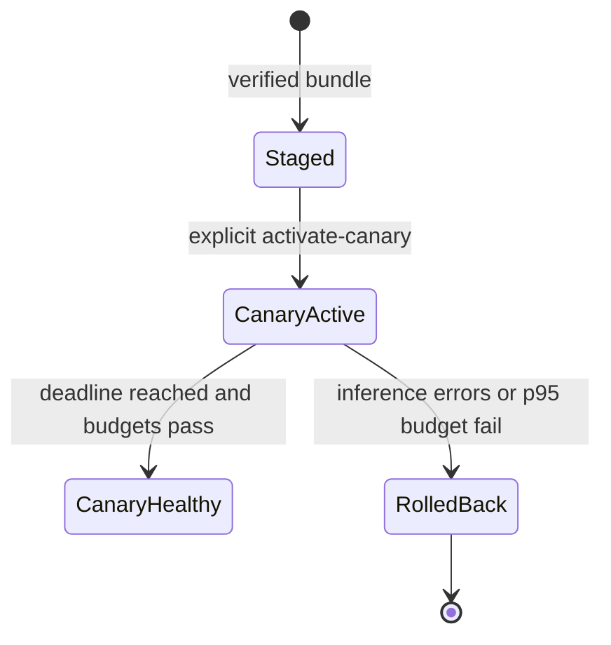

# SenseL P3-D Edge Canary Activation and Rollback

P3-D adds a non-networked model manager beside the packet sensor. It verifies the Site release signature,
Control Plane distribution signature, exact ONNX digest, Edge scope, expiry and transparency checkpoint
before writing any model bytes.

## Trust and state flow



`current` is an atomic relative symlink under `data/models/xgboost`. Activation preserves its previous
target. A failed health evaluation atomically restores that last-known-good target; if no previous target
exists, the new model is removed from `current`.

## Security boundaries

| Boundary | Enforcement |
|---|---|
| Artifact intake | `network_mode=none`, read-only inbox, maximum bundle size |
| Trust | Separate Site release and Control Plane distribution public keys |
| Scope | Exact tenant/site/sensor IDs and bundle expiry |
| Activation | Only a staged distribution can enter canary |
| Replay | Distribution ID cannot be rebound to another release/digest |
| Feedback | Edge signs deterministic `ModelRolloutReport` protobuf |
| Fleet rollout | Not implemented; `canary_healthy` remains canary state |

## Operations

Place the downloaded protobuf bundle in the configured inbox, then run the one-shot manager:

```text
docker compose --profile model-rollout run --rm sensel-model-manager \
  stage --bundle /input/bundle.pb

docker compose --profile model-rollout run --rm sensel-model-manager \
  activate-canary --distribution-id distribution-<sha256>

docker compose --profile model-rollout run --rm sensel-model-manager \
  evaluate --distribution-id distribution-<sha256> \
  --inference-count 100 --inference-errors 0 --p95-latency-ms 3.2 \
  --report-out /output/report.pb
```

The evaluator performs rollback automatically when either signed canary budget is exceeded. Scheduling the
evaluation and uploading `report.pb` belongs to the deployment orchestrator; P3-D keeps the model parser and
model filesystem unavailable to that network transport.

## Runtime integration

The atomic `current/model.onnx` pointer and its verified `deployment.json` are the deployment boundary. On
startup the packet sensor discovers the XGBoost path, version, digest and output indexes from this manifest,
so operators do not need to rewrite model environment variables after activation. The packet sensor must
still be restarted/reloaded after the pointer changes. Hot in-process ONNX session replacement is deferred;
P3-D does not grant the model manager Docker socket or process-control privileges.
