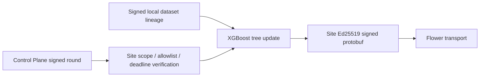

# SenseL P4-A Site Federation Boundary

P4-A extends the framework-neutral `FederatedClient` seam with two fail-closed operations: verify the
Control Plane signed `FederationRoundSpec`, then create a Site-key signed `ClientUpdateManifest` containing
the exact XGBoost JSON digest, dataset identity, sample count, feature contract and base model version.

## Trust flow

## Algorithm boundary

| Model | P4-A behavior |
|---|---|
| XGBoost | `FedXgbBagging`; one model-specific tree update per Site |
| Tiny LSTM | Deferred until full verified sequence materialization exists |
| Isolation Forest | Remains a local baseline; never passed to FedAvg |

The Site refuses a wrong tenant, missing Site allowlist membership, incompatible feature contract, stale
deadline, unsupported strategy or invalid coordinator signature. A local update is not a release artifact and
has no activation path.
