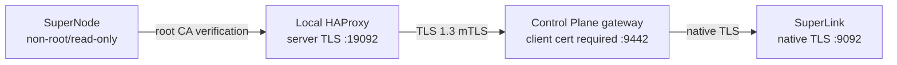

# SenseL P4-B SuperNode Production Transport

P4-B 在 Site 增加 Flower 1.33 `SuperNode` 與 local TLS bridge。外部 Site → Control Plane 連線強制
TLS 1.3 mTLS；SuperNode 同時以獨立 Flower EC private key 完成 application-level authentication。

## 🔒 連線模型



> [!NOTE]
> Flower 的 `--root-certificates` 本身不是 mTLS。`site-client.pem` 由 HAProxy 使用，讓 private key
> 不必交給 Flower process；SuperNode key 則只用於 Flower node authentication。

## 🔑 Site secrets

| 環境變數 | 必要內容 |
|---|---|
| `SENSEL_FLOWER_LOCAL_TLS_DIR` | `ca.crt`、含 private key 的 `server.pem`；SAN 含 `127.0.0.1` |
| `SENSEL_FLOWER_SITE_MTLS_DIR` | Control Plane `ca.crt`、該 Site 專屬 `site-client.pem` |
| `SENSEL_FLOWER_APPIO_TLS_DIR` | `ca.crt`、`supernode.pem`、`supernode.key` |
| `SENSEL_FLOWER_SUPERNODE_AUTH_DIR` | `supernode.key`、供註冊使用的 `supernode.pub` |

每台 Site 使用不同 client certificate 與 SuperNode key。將 private key 設為 mode `0600`，並由
secret manager 掛載；不要放進 `.env`、image 或 Git。

## 🚀 啟動與撤銷

operator 在 Control Plane 透過 `flwr supernode register` 註冊 `supernode.pub` 後，於 Site 啟動：

```bash
docker compose -f docker-compose.federation.yml config
docker compose -f docker-compose.federation.yml up --build -d
```

撤銷 Site 時需完成兩個獨立動作：從 Flower CLI registry 移除 public key，並由 PKI 撤銷／停止信任
client certificate。只做其中一項不算完整撤銷。

## ⚠️ 失效行為

Transport 中斷時 SuperNode 可重連，但 Control Plane 不會把舊 terminal round 恢復為 active。
operator 必須先 abort 原 round，再以新 nonce 建立 recovery round。Edge deterministic detection 與
EdgeX device management 不依賴 Flower，聯邦服務失效時仍持續運作。
