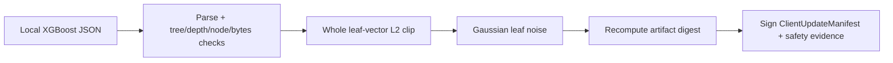

# SenseL P4-C Site Update Clipping

P4-C 讓 Site 在簽章與上傳 XGBoost update 前，執行 Control Plane 簽章政策中的 structure gate、完整
leaf-vector L2 clipping 與 scoped Gaussian noise。輸出的 `UpdateSafetyEvidence` 與 artifact digest 一起
被 Site key 簽章。

## 🔒 Site 處理順序

| 檢查 | Site 行為 |
|---|---|
| Unsupported JSON / cycle / non-finite leaf | 拒絕 upload |
| 超過 tree/depth/node/bytes | 拒絕 upload，不做 silent truncation |
| Leaf L2 超限 | 對完整 vector 等比例 clipping |
| 未知 privacy mechanism | 拒絕 round |
| Full-model DP flag | 永遠輸出 `false` |

## ⚠️ Privacy 聲明邊界

`leaf_vector_gaussian_v1` 的 scope 是 `leaf_values_only_fixed_topology`。Tree split topology 是從資料學得，
不受此 mechanism 保護。這項限制必須保留在產品文件、稽核輸出與客戶聲明中。

## 🧪 驗證

Site unit tests涵蓋：3-4-5 leaf vector clipping、Gaussian sigma evidence、structure overflow、signed round
scope 與 protobuf digest。Federation unavailable 時，Edge deterministic detection 與 EdgeX device
management 繼續運作，不依賴此 upload path。
