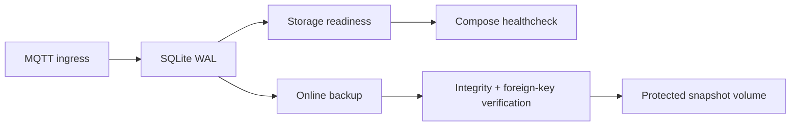

# SenseL P5 Site Production Hardening

## 🎯 結論

Site production gate 現在會檢查 SQLite database/WAL budget、`quick_check`、foreign keys，並以 SQLite online backup API 建立一致 snapshot。備份完成後會重新以 read-only mode 驗證 integrity 與 SHA-256，再以 `0600` 權限 atomic publish。

---

## 🏗️ Runtime Boundary

| 控制 | 預設值 | 失敗行為 |
|---|---:|---|
| Database budget | 10 GiB | Site health `degraded` |
| WAL budget | 512 MiB | Compose healthcheck fails |
| Backup interval | 24 hours | Sidecar retries after restart |
| Backup retention | 30 days | 只刪除受控 backup root 內的 matching snapshots |
| Snapshot permissions | `0600` | 不發布寬鬆權限的 snapshot |

> [!WARNING]
> Named volume snapshot 仍需由平台複製至具 immutability、encryption 與 off-site retention 的儲存。單機 Docker volume 不構成 disaster recovery。

---

## 🧪 Release Gate

- 在實際 ARM 裝置驗證 24 小時 WAL growth 與 backup latency。
- 模擬 power loss 後執行 `quick_check`、foreign-key check 與 episode replay。
- 驗證磁碟滿載時 Tier 1 detection 不被 Site storage 阻塞。
- 從 off-site snapshot 還原到新裝置並核對 dataset lineage 與 artifact digests。
