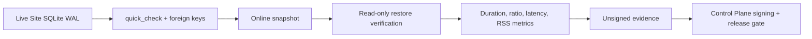

# SenseL P5-B Edge Soak Evidence

## 🎯 結論

`sensel_site.soak_evidence` 會對真實 Site SQLite database 重複執行 integrity gate、online snapshot 與 read-only restore，並輸出可交給 Control Plane release gate 驗簽的 evidence。短跑適合驗證流程；正式變電站 profile 固定要求 72 小時。

---

## 🧪 Probe Boundary

| 指標 | 用途 | 正式門檻 |
|---|---|---:|
| `duration_seconds` | 防止短跑冒充 soak | ≥259,200s |
| `pass_ratio` | storage/snapshot 成功率 | ≥0.999 |
| `restore_attempts` | 證明備份可讀 | ≥3 |
| DB/WAL maximum | 驗證容量預算 | 不超過部署設定 |
| snapshot P95 | ARM backup latency evidence | 保留供 release review |

> [!WARNING]
> 這個 harness 驗證 Site storage 與 recovery path。完整 production evidence 仍必須搭配既有 pipeline 72h probe，涵蓋 mirror traffic、MQTT、EdgeX、Control Plane ingest 與 portal freshness。
