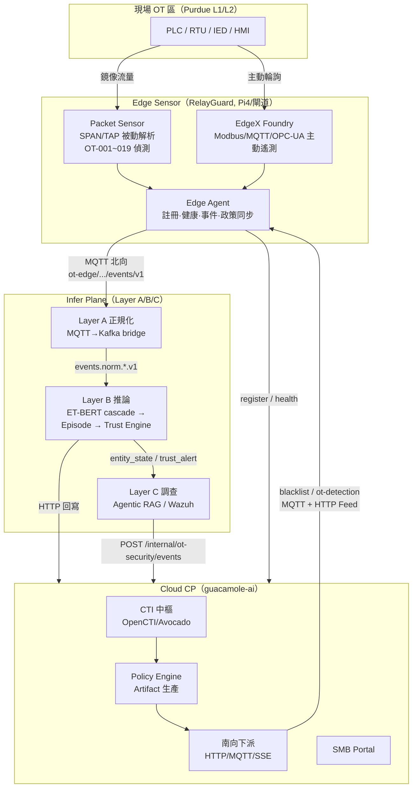
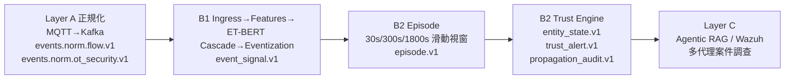
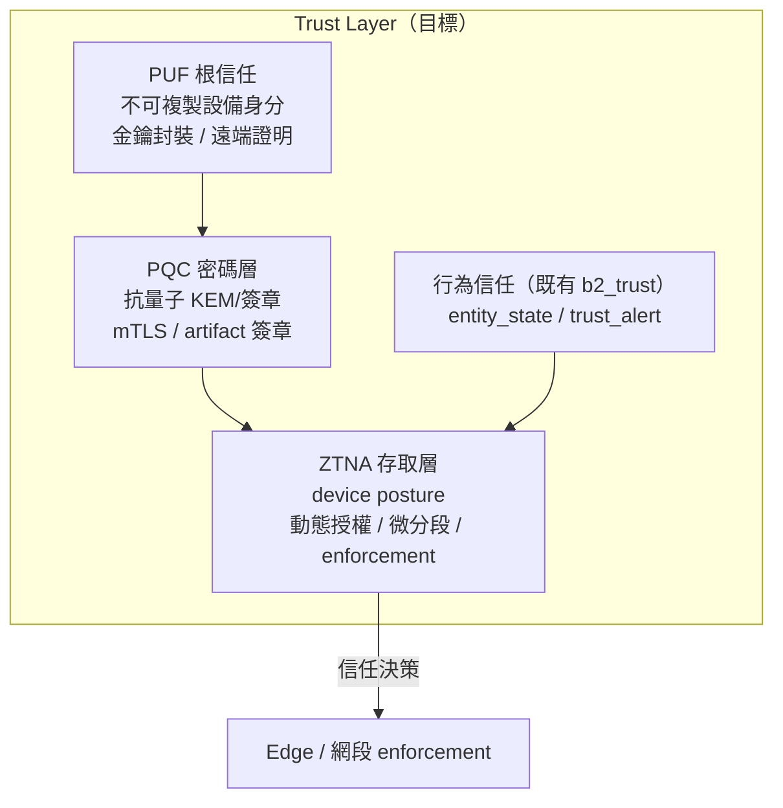
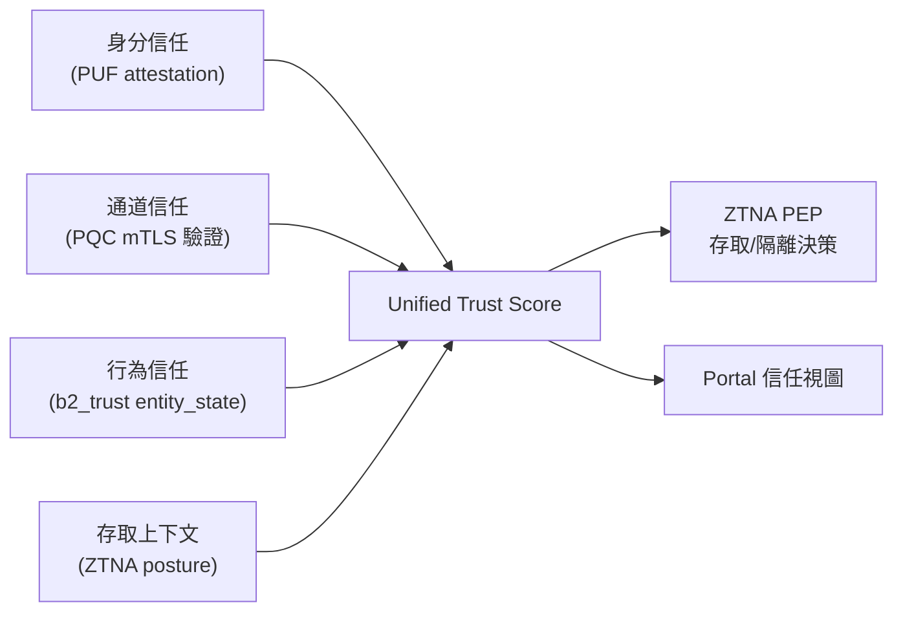

# SenseL OT 資安解決方案 — 系統架構與 PRD（Trust Layer 遷入方向）

> 狀態：Draft v0.1｜對象：ZTNA / PUF / PQC 合作夥伴｜維護：產品/架構團隊

---

## 0. 文件目的與讀者

本文件以 **OT（Operational Technology）視角**，整合 SenseL 解決方案中三個核心專案的系統架構與產品需求，並明確指出將解決方案**遷入「Trust Layer（信任層）」**的方向，作為與 **ZTNA、PUF、PQC** 合作夥伴對接的技術說明書。

### 三個專案

| 代號 | Repo | 角色 | 部署位置 |
|------|------|------|----------|
| **Edge Sensor** | `sensel-ot-edge-sensor`（RelayGuard） | OT 邊緣被動偵測 + EdgeX 主動遙測閘道 | Pi4 / 工業閘道（廠區） |
| **Infer Plane** | `Aristaconnector-Control-Plane`（`sensel-inferplane`） | Layer A/B/C 推論、Episode 聚合、**Trust Engine**、Agentic 調查 | 站點 / 區域 control plane |
| **Cloud CP** | `guacamole-ai`（SenseL AI Security Control Plane） | CTI 中樞、Policy Artifact 生產、**南向 rule 下派**、SMB Portal | 雲端 |

> ⚠️ 名詞澄清：`guacamole-ai` 為內部代號，**非** Apache Guacamole 遠端桌面；文件中的 `c2` 指 Control Plane 部署主機，非 C2 中繼站。

### 讀者應帶走的三件事

1. 我們目前的端到端架構與資料流（從 OT 設備到雲端）長什麼樣子。
2. 我們現行「信任」是怎麼算出來的（行為信任 `b2_trust`）、身分與通道安全的**現況與缺口**。
3. ZTNA / PUF / PQC 三方各自要遷入 Trust Layer 的**接點、契約與分工**。

---

## 1. 整體系統架構（OT 視角）

### 1.1 分層定位（對齊 Purdue Model）

```
┌─────────────────────────────────────────────────────────────────┐
│ Level 4/5 企業/雲端    │  Cloud CP (guacamole-ai)                  │
│                        │  CTI 中樞 · Policy 生產 · 南向下派 · Portal│
├─────────────────────────────────────────────────────────────────┤
│ Level 3 站點營運       │  Infer Plane (sensel-inferplane)          │
│                        │  Layer A 正規化 · Layer B 推論/Trust       │
│                        │  Layer C Agentic 調查 (Wazuh-first)        │
├─────────────────────────────────────────────────────────────────┤
│ Level 2/1 控制/現場    │  Edge Sensor (RelayGuard)                 │
│  PLC/RTU/IED/HMI       │  被動鏡像偵測 + EdgeX 主動遙測             │
│  Modbus/OPC-UA/S7/61850│  本地告警 · 證據 · 政策同步                │
└─────────────────────────────────────────────────────────────────┘
```

### 1.2 端到端資料流



### 1.3 關鍵設計原則

- **被動優先、不阻斷**：原始鏡像流量不進 EdgeX；MVP 邊緣**不做自動阻斷**，定位於偵測、告警、baseline 漂移與威脅情報比對。阻斷/隔離由上游政策在後續階段實現（此處正是 ZTNA enforcement 的切入點）。
- **雙路徑遙測**：主動（EdgeX Modbus/MQTT/OPC-UA）+ 被動（Packet Sensor L2–L7）。
- **可解釋信任**：Layer B Trust Engine 以 episode 驅動、penalty/recovery 公式化、可稽核（reason_log）。
- **南北向分離**：北向走 MQTT/HTTP 上報；南向走 Policy Artifact（HTTP Feed / MQTT / SSE）下派。

---

## 2. 功能模組 PRD

### 2.1 設備管理（Device Management）

OT 設備管理分三條軌道，互補形成完整資產清冊：

| 軌道 | 機制 | 風險 | 來源 |
|------|------|------|------|
| **感測器自身註冊** | Edge Agent `POST /api/v1/edge-sensors/register`（API Key + 企業邀請碼 `registration_token`） → 綁定 `tenant_id` | — | `sensel-edge-agent/src/api/client.py` |
| **EdgeX 主動設備** | Console 設備精靈產生 YAML（Modbus/MQTT/OPC-UA/S7），可選 container 重啟 | 低（唯讀輪詢） | `edge-console/src/edgex_config_service.py` |
| **Mirror 被動發現** | 從鏡像流量擷取 MAC/IP/通訊對，與 EdgeX endpoint 做 IP→device 映射，標記 `mirror_only`/`edgex` | 零（被動） | `edge-console/src/discovery_service.py` |

- **資產身分強化**：支援手動覆寫 vendor/model/firmware，及 **opt-in 唯讀主動探測**（Modbus FC43 + TCP fingerprint，明確 *Never writes to a device*）。
- **Baseline 學習**：Console 可 learn/approve/rollback 行為基線。
- **雲端登錄**：Cloud CP `SMBOtEdgeSensorRow` 記錄 `sensor_id / tenant_id / site_id / capabilities / status / last_seen_at`。

> **Trust Layer 缺口**：目前設備「身分」依賴可複製的 API Key + 邀請碼，**無硬體級不可複製身分**。→ 這是 **PUF** 的切入點（§4.2）。

### 2.2 設備端防禦（Device-Side Defense）

| 能力 | 說明 | 來源 |
|------|------|------|
| **被動偵測引擎** | OT-001~010（網路行為）、OT-011~018（IEC 61850 GOOSE/MMS）、OT-019（CTI IoC 比對） | `packet-sensor/src/detection/rules.py` |
| **CTI IoC 比對** | 從 Cloud CP 拉/收 blacklist（HTTP + MQTT），本地 `ioc-cache.json` 熱重載；命中冷卻 300s；回報 sighting | `sensel-edge-agent/src/policy/sync.py` |
| **偵測政策下發** | 訂閱 `sensel/{tenant_id}/policy/ot-detection`，套用 `rules_enabled` + baseline；Console 唯讀顯示 | `detection_policy_sync.py` |
| **證據留存** | 記憶體 ring buffer，產生 `local-ringbuffer://` 參考；預設不上傳完整 PCAP | `packet-sensor/src/evidence/ring_buffer.py` |
| **離線韌性** | 事件/health SQLite 緩衝 + 指數退避重連 | `sensel-edge-agent/src/upload/buffer.py` |

> **現況**：UI 的 `Block`/`Quarantine` 為**建議動作啟發式**，**邊緣無 inline drop/iptables/XDP 封鎖**（XDP 僅用於擷取加速）。
>
> **Trust Layer 缺口**：缺乏「依信任分數 → 動態存取控制 / 微分段」的 enforcement 能力。→ 這是 **ZTNA** 的切入點（§4.4）。

### 2.3 Layer A / B / C 分析



#### Layer A（擷取/正規化，`sensel-dataplane`）
MQTT/Kafka 接入與正規化，不做推論。OT 規則事件走 `events.norm.ot_security.v1`，流量走 `events.norm.flow.v1`。

#### Layer B（推論 + 信任，`sensel-inferplane`）— **核心 Trust 計算所在**

- **B1 推論**：ET-BERT cascade（Stage1 benign/malicious → Stage2 c2 / data_exfiltration / https_tunneling / domain_fronting），threshold gating + 行為 heuristics，映射 MITRE TTP。
- **B2 Episode**：多時間窗聚合 event_signal，產出 `malicious_count / burst_score / cross_zone`。
- **B2 Trust Engine（`TrustScoreEngineV1`）**：
  - 公式：`T_new = clamp01(T_old − F_penalty(E) + G_recovery(t))`
  - **Penalty** = `0.35×severity + 0.20×recurrence + 0.30×sequence_anomaly + 0.15×classifier_confidence`
  - **Recovery**：僅在無新 malicious 時，`0.002/min`、單次上限 `0.05`
  - **Trust Level**：healthy ≥0.85｜suspicious ≥0.70｜degraded ≥0.50｜critical <0.50
  - **Trust Alerts**：`trust_critical`、`multi_high_risk_labels`、`c2_exfil_combo`
  - **跨域傳播**：source 為 degraded/critical 時，沿可配置信任圖 BFS（max 2 hops，邊 confidence≥0.7）傳播風險，寫 `propagation_audit`。
  - 邊係數示例：`identity→workstation 0.7`、`workstation→plc 0.5`、`zone_to_zone 0.1`。

#### Layer C（調查，`src/`）
Wazuh-first 多代理（Agentic RAG）案件調查，將 B2 artifact 轉為調查 Episode，結合 CTI correlation 與 OT 知識庫。

> **這就是我們既有的「軟體信任層」**：以**行為**為基礎的 entity trust score。ZTNA/PUF/PQC 要做的是補上**身分根信任**與**通道/存取信任**，與此行為信任融合成完整 Trust Layer（§4.5）。

### 2.4 Guacamole 雲端服務（Cloud Control Plane）

雲端中樞，**非遠端桌面**，提供：

| 功能 | 說明 | 來源 |
|------|------|------|
| **CTI 中樞** | OpenCTI SSE/GraphQL 訂閱、Stream Proxy（下游不需 OpenCTI 帳密）；Avocado CTI feed | `services/opencti_gateway.py`、`services/cti/*` |
| **Policy Artifact 生產** | 版本化 blacklist、STIX、Suricata/Snort/Wazuh CDB、TLS 指紋（ja3/ja4/jarm） | `policy/`、`services/_plugins/distribution_plugin.py` |
| **南向 Gateway** | HTTP Feed / MQTT / SSE 下派給防火牆 / NDR / OT 邊緣 | `channels/` |
| **SMB Portal** | 企業註冊、EDR/NDR/OT/WAF 營運 UI、Portal 功能權限矩陣（hidden/view/use） | `smb_subscription/` |
| **多代理人編排** | OpenClaw Workforce（OC-COLL→…→AEGIS）情資採集→分析→策略→派送 | `services/workforce.py` |

- **北向接點**：Layer C → `POST /internal/ot-security/events`；Layer B → `POST /api/v1/inference/results`、`/api/v1/cases/writeback`；邊緣 → `register/health`、`/api/v1/sightings`。
- **CTI Status Rail**（`cti.status_rail.v1`）：OpenCTI / Bridge / Ollama / ingest 即時燈號。
- **租戶對齊**：`smb_subscribers.tenant_id` = Arista `TENANT_ID` = Feed path tenant，貫穿三專案。

### 2.5 CTI 與 Rule 下派（Rule Distribution）

> 重點：本解決方案的「rule 下派」由 **Cloud CP 集中生產 + 南向 push**，邊緣訂閱套用；推論規則（TTP/OT rule 解讀）則為靜態映射。

#### A. CTI / IoC blacklist（主要情資下派）
```
OpenCTI/Avocado → 評分 → PolicyEngine.build() → artifact_ready
   → OC-DIST：feed_store.put() + 磁碟持久化 + SSE broadcast + MQTT publish
```
- **HTTP Feed**：`GET /api/v1/feed/{tenant}/{blacklist.json | .txt | wazuh-cdb.txt | fingerprints.json | suricata.rules | snort.rules | stix-bundle.json}`（ETag/304）
- **MQTT**：`sensel/{tenant_id}/policy/blacklist`
- **認證**：SMB API Key（`key_hash`）；每次拉取寫 `endpoint_activity`、CP 主動送出寫 `delivery_records`。

#### B. OT 偵測政策（邊緣感測器規則）
```
Portal 編輯 (rules_enabled + baseline) → ot_detection_policy.v1
   → MQTT publish sensel/{tenant_id}/policy/ot-detection → Edge 套用
```
- 規則目錄 OT-001~019（Modbus、埠掃描、IEC61850、CTI IoC 命中等）。

#### C. 推論規則映射（control plane 內部，非下派）
- **OT 規則解讀**：邊緣執行 OT-001~018 → 上報 → Layer B 用靜態 `OT_RULES` 表 + TTP JSON 解讀（`decision_basis="ot_rule_severity"`）。
- **Layer B TTP 規則表**：`configs/ttp_rules/layerb_ttp_rules.v1.json`，stage2 label → MITRE TTP。

| 管線 | 方向 | 通道 | 內容 |
|------|------|------|------|
| CTI blacklist | 雲端→邊緣/NDR/FW | HTTP Feed + MQTT + SSE | IoC（IP/domain/hash）、IDS 規則、TLS 指紋 |
| OT detection policy | 雲端→邊緣 | MQTT | rules_enabled、baseline 白名單 |
| OT rule 上報 | 邊緣→雲端/Layer B | MQTT→Kafka | OT-001~019 事件 |

> **Trust Layer 缺口**：下派通道目前依賴 **API Key + （選用）TLS**，無端到端簽章驗證、無抗量子保護，金鑰可被複製/重放。→ 這是 **PQC**（簽章/通道）與 **PUF**（金鑰封裝）的切入點。

---

## 3. 現行信任與身分機制盤點（現況 vs. 缺口）

| 面向 | 現況實作 | 缺口 / 風險 | 補強方 |
|------|----------|-------------|--------|
| **設備身分** | API Key（Bearer）+ 企業邀請碼 `registration_token` → `tenant_id` | 金鑰可複製、可外洩、無硬體綁定、無法防止 sensor 仿冒 | **PUF** |
| **行為信任** | Layer B `TrustScoreEngineV1`（penalty/recovery/propagation，可解釋） | 僅看「行為」，不含「身分可信度」與「存取上下文」 | 與 ZTNA/PUF 融合 |
| **南北向通道** | HTTPS/TLS（生產必填）、MQTT TLS（選用）、Nginx 反向代理 | 經典 ECDHE/RSA，**不抗量子**；MQTT/EdgeX lab 段為 `authmode=none` | **PQC** |
| **下派完整性** | API Key 取用 + ETag；artifact 本身**未端到端簽章** | 中間人可竄改/重放 policy artifact | **PQC 簽章** |
| **存取控制** | RBAC（Portal 角色）、JWT、Feature Matrix | **無設備層 ZTNA**：邊緣對 OT 網段無 posture-based 微分段/動態授權 | **ZTNA** |
| **Enforcement** | 僅「建議動作」，邊緣不阻斷 | 信任降級無對應的網路隔離動作 | **ZTNA** |
| **憑證生命週期** | 靜態儲存（`password_encrypted`、`key_hash`）；WAF SSL 匯入 | 無自動輪替、無硬體根、無 PQC 憑證鏈 | **PUF + PQC** |
| **mTLS** | 文件建議、**未內建** | ingest/南向皆缺雙向認證 | **PUF + PQC（mTLS）** |

**結論**：我們已有成熟的**行為信任層（軟體）**，但缺少**身分根信任（硬體）**、**抗量子通道與簽章**、以及**零信任存取/enforcement**。這三塊正是合作夥伴遷入 Trust Layer 的價值所在。

---

## 4. Trust Layer 目標架構（ZTNA / PUF / PQC 遷入方向）

### 4.1 為什麼需要 Trust Layer

將分散在各專案的「信任相關」能力收斂為一個**橫切的 Trust Layer**，提供統一的：
**身分（誰）→ 通道（怎麼傳）→ 存取（能做什麼）→ 行為（做得對不對）** 四元信任判定。



**核心理念**：PUF 提供「**身分**」、PQC 保護「**通道與證據**」、ZTNA 執行「**存取與隔離**」，三者餵入並消費既有的「**行為信任分數**」，形成閉環。

### 4.2 PUF — 硬體根信任與設備身分

**目標**：以 PUF（Physical Unclonable Function）為每個 Edge Sensor / 閘道提供**不可複製的硬體身分根**，取代/強化現行可複製的 API Key。

| 遷入點 | 現況 | PUF 後 |
|--------|------|--------|
| 感測器註冊 | `registration_token` + API Key | PUF 衍生 challenge-response 做設備認證 + 綁定 `sensor_id` |
| 金鑰儲存 | 檔案 `platform.json`（chmod 600） | PUF 封裝（key-wrapping），私鑰不落地 |
| 設備證明 | 無 | PUF-based 遠端證明（attestation）隨 health 上報 |
| 反仿冒 | 無 | 偽造 sensor 無對應 PUF response，註冊即拒 |

**建議接點**：
- 擴充 `POST /api/v1/edge-sensors/register` 增加 `puf_attestation` 欄位（challenge/response 或 attestation token）。
- Cloud CP `SMBOtEdgeSensorRow` 增 `puf_public_id` / `attestation_status`。
- Health 上報（每 30s）夾帶 attestation nonce，雲端驗證設備未被替換。

### 4.3 PQC — 抗量子通道與簽章

**目標**：以 NIST PQC 標準（**ML-KEM/Kyber** 金鑰封裝、**ML-DSA/Dilithium** 簽章）保護所有南北向通道與下派 artifact，達成 **crypto-agility**（混合經典+PQC，再漸進切換）。

| 遷入點 | 現況 | PQC 後 |
|--------|------|--------|
| 北向 HTTPS（events/telemetry/health） | TLS 1.3 ECDHE | **混合 PQC TLS**（X25519+ML-KEM） |
| MQTT 北向 | 選用 TLS | PQC-TLS（與 PUF 金鑰結合的 mTLS） |
| Policy Artifact（blacklist/規則） | API Key 取用，無簽章 | **ML-DSA 簽章** artifact，邊緣驗章後才套用 |
| 憑證鏈 | RSA/ECDSA | PQC / 混合憑證，支援輪替 |

**建議接點**：
- Policy Artifact schema 增 `signature` + `sig_alg`（如 `ML-DSA-65`）+ `key_id`；Edge Agent 套用前驗章（`policy/sync.py`、`detection_policy_sync.py`）。
- 南向 Feed/MQTT 與北向 ingest 啟用混合 PQC-TLS（Nginx / broker 終端）。
- 與 PUF 整合：PQC 私鑰由 PUF 封裝，簽/驗章金鑰具硬體根。

### 4.4 ZTNA — 零信任存取與 enforcement

**目標**：補上「**依信任決策做存取控制與微分段**」的執行層，將既有「建議動作」升級為真正的 enforcement。

| 遷入點 | 現況 | ZTNA 後 |
|--------|------|---------|
| 設備存取 | 平面網路，被動觀測 | device posture + 持續驗證，預設拒絕 |
| 信任→動作 | UI 建議 `Block/Alert/Observe` | 信任降級（degraded/critical）觸發**微分段 / 隔離 / 限流** |
| 南北向連線 | API Key | ZTNA broker 仲介，per-session 授權 |
| 橫向移動 | 無防護 | 依 trust 圖（§2.3 的傳播圖）做 east-west 分段 |

**建議接點**：
- 訂閱 Layer B `results.layerb.entity_state.v1` / `trust_alert.v1` 作為 ZTNA policy decision point（PDP）輸入。
- 將 Trust Engine 的傳播圖（`identity→workstation→plc`、`zone_to_zone`）作為 ZTNA 微分段拓撲基礎。
- Edge Sensor 增 enforcement adapter（如與 ZTNA gateway / NAC 整合），把「建議動作」對接到實際的網段控制。

### 4.5 與既有行為信任（b2_trust）的融合

**統一信任分數（Unified Trust Score）= f(身分信任, 通道信任, 行為信任, 存取上下文)**



- **融合方式建議**：在 Layer B Trust Engine 的 `reason_log` 中新增 `identity_component` 與 `channel_component`，把 PUF attestation 結果與 PQC 通道驗證納入 penalty/gating（例如：attestation 失敗 → 直接 critical）。
- ZTNA 作為 **Policy Enforcement Point（PEP）**，消費 Unified Trust Score 做即時授權。

---

## 5. 整合契約（給合作夥伴的接點清單）

| # | 接點 | 現有介面 | 需擴充 | 負責方 |
|---|------|----------|--------|--------|
| I-1 | 設備註冊 attestation | `POST /api/v1/edge-sensors/register` | 增 `puf_attestation` 欄位 + 雲端驗證 | PUF + 我方 |
| I-2 | 設備證明上報 | `POST /api/v1/edge-sensors/health` | 夾帶 attestation nonce/簽章 | PUF + 我方 |
| I-3 | Artifact 簽章 | Policy Artifact JSON（blacklist/ot-detection） | 增 `signature/sig_alg/key_id`，邊緣驗章 | PQC + 我方 |
| I-4 | 通道加密 | HTTPS/MQTT-TLS（Nginx/broker） | 啟用混合 PQC-TLS + mTLS | PQC + PUF |
| I-5 | 信任決策輸入 | Kafka `entity_state.v1` / `trust_alert.v1` | ZTNA 訂閱作為 PDP 輸入 | ZTNA + 我方 |
| I-6 | 微分段拓撲 | Trust 傳播圖（`LAYERB_GRAPH_EDGES_JSON`） | 對映 ZTNA 分段策略 | ZTNA + 我方 |
| I-7 | Enforcement 動作 | UI 建議動作（Observe/Alert/Block） | Edge enforcement adapter ↔ ZTNA gateway/NAC | ZTNA + 我方 |
| I-8 | 統一信任分數 | `reason_log` components | 增 identity/channel component | 三方 + 我方 |

---

## 6. 遷移路線圖（Phased）

| 階段 | 目標 | 關鍵交付 | 對應夥伴 |
|------|------|----------|----------|
| **P0 基線（現況）** | 行為信任 + CTI 下派 + 被動偵測上線 | 既有三專案 MVP | — |
| **P1 身分根信任** | PUF 設備身分、attestation 上報、反仿冒註冊 | I-1, I-2；`SMBOtEdgeSensorRow` 擴充 | PUF |
| **P2 抗量子通道** | 混合 PQC-TLS、Artifact 簽章驗證 | I-3, I-4；crypto-agility 框架 | PQC |
| **P3 零信任存取** | entity_state→ZTNA PDP、微分段、enforcement adapter | I-5, I-6, I-7 | ZTNA |
| **P4 統一信任融合** | Unified Trust Score、身分/通道 component 納入 Trust Engine | I-8；Portal 統一信任視圖 | 三方 |

> 設計原則：**漸進、相容、可回退**。每階段保持與 P0 介面相容（新增欄位為 optional），先 hybrid 再切換，先 audit-only 再 enforce。

---

## 7. 風險與開放議題

- **OT 即時性**：PQC 握手/簽章驗證的延遲是否符合 OT 控制迴路與 Pi4 算力限制？需 benchmark。
- **PUF 載體**：Pi4 / 工業閘道是否具備 PUF 硬體（TPM/SE/SRAM-PUF）？是否需外加安全晶片？
- **離線韌性**：邊緣離線時，artifact 驗章 / attestation 如何處理（容許 grace period？快取信任根？）。
- **enforcement 邊界**：ZTNA 在 OT 現場做隔離，須避免誤阻斷影響生產安全（fail-open vs fail-secure 政策）。
- **金鑰治理**：PUF 衍生金鑰 + PQC 憑證的輪替、撤銷、與既有 `tenant_id` 模型對齊。
- **標準對齊**：PQC 演算法選型（ML-KEM/ML-DSA）與遷移時程須跟隨 NIST / 產業標準。

---

## 附錄 A — 關鍵程式碼錨點

| 主題 | 路徑 |
|------|------|
| 邊緣偵測規則 | `sensel-ot-edge-sensor/services/packet-sensor/src/detection/rules.py` |
| 邊緣註冊 / API | `sensel-ot-edge-sensor/services/sensel-edge-agent/src/api/client.py` |
| 政策同步（CTI/偵測） | `sensel-ot-edge-sensor/services/sensel-edge-agent/src/policy/` |
| Trust Engine | `Aristaconnector-Control-Plane/sensel-inferplane/b2_trust/trust_engine_v1.py` |
| Penalty/Recovery/傳播 | `sensel-inferplane/b2_trust/{penalty,recovery,propagation_engine}.py` |
| OT 規則映射 | `sensel-inferplane/b1_ingress/ot_security_rules.py` |
| Policy 下派 | `guacamole-ai/sensel_control_plane/services/_plugins/distribution_plugin.py` |
| OT 偵測政策下派 | `guacamole-ai/.../services/ot_security/detection_policy_service.py` |
| 南向契約 | `guacamole-ai/docs/ENFORCEMENT_FEED_SPEC.md` |
| 三專案整合規格 | `guacamole-ai/docs/INTEGRATION_ARISTACONNECTOR_GUACAMOLE_AI.md` |

## 附錄 B — 名詞對照

| 縮寫 | 全稱 | 在本方案的角色 |
|------|------|----------------|
| PUF | Physical Unclonable Function | 硬體不可複製設備身分根 |
| PQC | Post-Quantum Cryptography | 抗量子金鑰封裝（ML-KEM）與簽章（ML-DSA） |
| ZTNA | Zero Trust Network Access | 零信任存取仲介與 enforcement |
| TTP | Tactics, Techniques, Procedures | MITRE ATT&CK 對應 |
| PDP/PEP | Policy Decision / Enforcement Point | ZTNA 決策與執行點 |
| Episode | — | Layer B 時間窗聚合事件單元 |
| entity_state | — | Layer B 輸出的實體信任狀態 |
