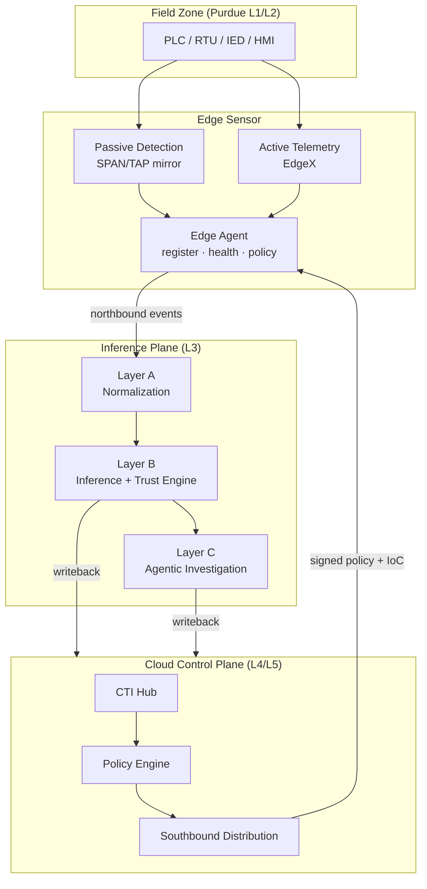
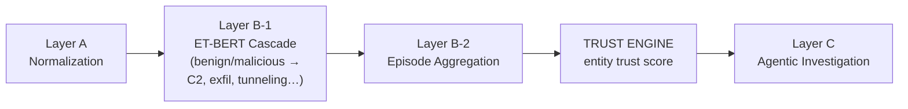
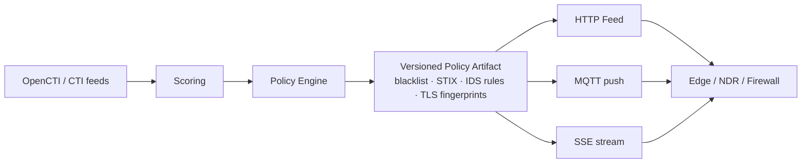
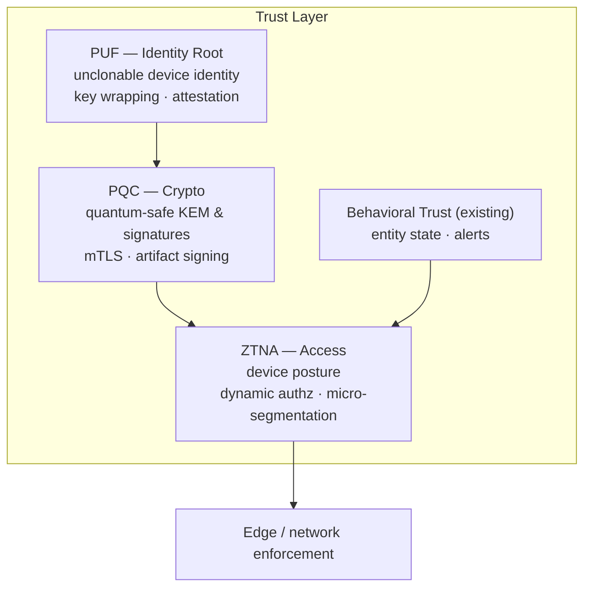
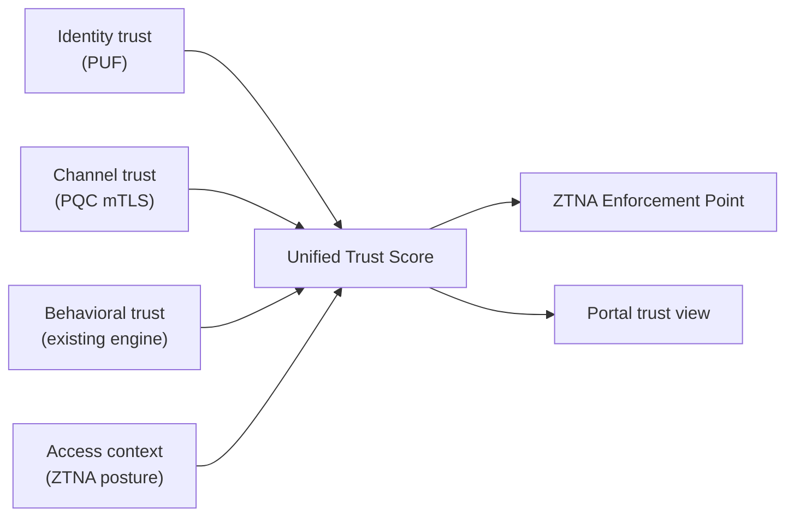

# SenseL OT Security — Trust Layer Briefing

**Partner Briefing for ZTNA · PUF · PQC Collaboration**

> Status: Draft v0.1 · Audience: Trust Layer Partners · Confidential

---

## Slide 1 — Executive Summary

SenseL delivers an **AI-native OT security solution** spanning the edge, the inference plane, and the cloud. We already operate a mature **behavioral trust layer** that scores every OT entity in real time.

To reach a complete **Zero-Trust posture for OT**, we are inviting three partners to migrate their capabilities into a unified **Trust Layer**:

| Partner | Provides | Answers the question |
|---------|----------|----------------------|
| **PUF** | Hardware root of identity | *Who is this device — really?* |
| **PQC** | Quantum-resistant channels & signing | *Can we trust how it was transmitted?* |
| **ZTNA** | Access decisions & enforcement | *What is this entity allowed to do?* |
| **SenseL (existing)** | Behavioral trust scoring | *Is it behaving correctly?* |

**The ask:** combine these four signals into one **Unified Trust Score** that drives real-time access and isolation decisions.

---

## Slide 2 — Who We Are: Three Building Blocks

```
┌──────────────────────────────────────────────────────────────┐
│  CLOUD CONTROL PLANE                                           │
│  CTI hub · Policy production · Southbound rule distribution    │
│  Multi-agent workforce · Customer portal                       │
├──────────────────────────────────────────────────────────────┤
│  INFERENCE PLANE  (Layer A / B / C)                            │
│  Normalization · ET-BERT inference · Episode aggregation       │
│  >> TRUST ENGINE <<  ·  Agentic investigation                  │
├──────────────────────────────────────────────────────────────┤
│  EDGE SENSOR  (industrial gateway / Raspberry Pi)              │
│  Passive traffic detection + active telemetry                  │
│  Local alerting · Evidence capture · Policy sync               │
└──────────────────────────────────────────────────────────────┘
```

- **Edge Sensor** — deployed in the plant; passively mirrors OT traffic (Modbus, OPC-UA, S7, IEC 61850) and actively polls telemetry. Detects threats, never disrupts the process.
- **Inference Plane** — site/regional brain. Classifies traffic with an ET-BERT cascade, aggregates events into episodes, and computes **per-entity trust**.
- **Cloud Control Plane** — threat-intelligence hub that produces and distributes policy (blacklists, detection rules) to the edge.

---

## Slide 3 — End-to-End Architecture (OT View, Aligned to Purdue Model)



**Design principles:** passive-first (no process disruption), explainable trust, clean north/south separation.

---

## Slide 4 — Capability 1: Device Management

Three complementary discovery tracks build a complete asset inventory:

| Track | How | Process risk |
|-------|-----|--------------|
| **Sensor registration** | Edge agent registers to cloud, bound to a tenant | — |
| **Active devices** | Guided wizard provisions Modbus / MQTT / OPC-UA / S7 | Low (read-only polling) |
| **Passive discovery** | Mirror traffic reveals MAC/IP, mapped to known devices | Zero (passive) |

Plus optional **read-only active probing** (never writes to a device) and **behavioral baseline** learning.

> **Gap → PUF:** device identity relies today on a *copyable* API key. There is **no hardware-bound, unclonable identity**.

---

## Slide 5 — Capability 2: Device-Side Defense

| Capability | What it does |
|------------|--------------|
| **Detection engine** | OT rules for network behavior, IEC 61850 (GOOSE/MMS), and CTI IoC hits |
| **Threat-intel matching** | Pulls/receives blacklists from cloud; hot-reloads local IoC cache |
| **Policy enforcement** | Subscribes to cloud detection policy; applies enabled rules + baselines |
| **Evidence capture** | In-memory ring buffer with evidence references |
| **Offline resilience** | Local buffering + exponential-backoff reconnect |

> **Today:** "Block / Quarantine" are *recommended actions only* — the edge **does not block inline**.
>
> **Gap → ZTNA:** there is no "trust score → dynamic access control / micro-segmentation" enforcement.

---

## Slide 6 — Capability 3: Layer A / B / C Analytics



### The Trust Engine — our existing software trust layer

- **Formula:** `T_new = clamp(T_old − Penalty(event) + Recovery(time))`
- **Penalty** weighs severity, recurrence, sequence anomaly, and classifier confidence.
- **Recovery** is slow and only when no new malicious activity occurs.
- **Trust levels:** Healthy → Suspicious → Degraded → Critical.
- **Cross-domain propagation:** a degraded/critical entity propagates risk along a configurable trust graph (e.g. `identity → workstation → PLC`), with full audit.

> This is **explainable, behavior-based trust**. Partners add the missing identity, channel, and access dimensions.

---

## Slide 7 — Capability 4 & 5: Cloud Service + Rule Distribution

**Cloud Control Plane** is a CTI hub and policy factory (not a remote-desktop product).



Two distribution pipelines:
1. **CTI / IoC blacklist** — IP / domain / hash indicators + IDS rules, pushed via HTTP Feed, MQTT, and SSE.
2. **OT detection policy** — enabled rules + baselines pushed to edge sensors over MQTT.

> **Gap → PQC + PUF:** distribution relies on a copyable API key + optional TLS. Artifacts are **not end-to-end signed** and channels are **not quantum-resistant**.

---

## Slide 8 — The Trust Gap (Current State vs. Need)

| Dimension | Today | Gap | Owner |
|-----------|-------|-----|-------|
| Device identity | Copyable API key + invite code | No hardware-bound identity | **PUF** |
| Behavioral trust | Mature scoring engine | Behavior-only; no identity/context | (fuse) |
| Channels | TLS (ECDHE/RSA) | **Not quantum-safe** | **PQC** |
| Policy integrity | API key access, no signing | Tamper / replay possible | **PQC** |
| Access control | Portal RBAC only | No device-level zero trust | **ZTNA** |
| Enforcement | Recommendations only | No isolation on trust drop | **ZTNA** |
| Certificates | Static, manual | No HW root, no rotation, no PQC | **PUF + PQC** |

**We have behavioral trust. We need identity, channel, and access trust.**

---

## Slide 9 — Target: The Unified Trust Layer





**Identity (PUF) → Channel (PQC) → Access (ZTNA) → Behavior (existing)** = one trust decision.

---

## Slide 10 — Partner Integration Points

| # | Integration | Extension needed | Partner |
|---|-------------|------------------|---------|
| 1 | Device registration | Add PUF attestation to enrollment | **PUF** |
| 2 | Health reporting | Carry attestation nonce / proof | **PUF** |
| 3 | Policy artifacts | Add signature + algorithm + key id; verify at edge | **PQC** |
| 4 | Channels | Hybrid PQC-TLS + mTLS for north/south | **PQC + PUF** |
| 5 | Trust decision input | Consume entity-state / trust-alert stream as policy input | **ZTNA** |
| 6 | Micro-segmentation | Map our trust graph to ZTNA segments | **ZTNA** |
| 7 | Enforcement | Edge adapter ↔ ZTNA gateway / NAC | **ZTNA** |
| 8 | Unified score | Add identity + channel components to the trust engine | **All** |

---

## Slide 11 — Phased Roadmap

| Phase | Goal | Partner |
|-------|------|---------|
| **P0** Baseline (today) | Behavioral trust + CTI distribution + passive detection live | — |
| **P1** Identity root | PUF device identity, attestation, anti-spoof enrollment | **PUF** |
| **P2** Quantum-safe | Hybrid PQC-TLS, signed & verified policy artifacts | **PQC** |
| **P3** Zero-trust access | Trust state → ZTNA decisions, micro-segmentation, enforcement | **ZTNA** |
| **P4** Unified trust | One score fusing identity, channel, behavior, context | **All** |

**Principles:** incremental · backward-compatible (new fields optional) · reversible (hybrid before cutover, audit before enforce).

---

## Slide 12 — Open Questions for Partners

- **Latency:** Can PQC handshakes / signature checks meet OT control-loop timing on constrained edge hardware (e.g. Raspberry Pi)?
- **PUF carrier:** Do target gateways have a PUF source (TPM / SE / SRAM-PUF), or is a secure element required?
- **Offline behavior:** How to handle attestation / artifact verification when the edge is disconnected (grace period? cached trust root)?
- **Safety:** Fail-open vs. fail-secure for ZTNA isolation in a live OT environment?
- **Key governance:** Rotation, revocation, and alignment with our tenant model.
- **Standards:** PQC algorithm selection (ML-KEM / ML-DSA) and migration timeline vs. NIST guidance.

---

## Glossary

| Term | Meaning |
|------|---------|
| **PUF** | Physical Unclonable Function — hardware root of device identity |
| **PQC** | Post-Quantum Cryptography — ML-KEM key encapsulation, ML-DSA signatures |
| **ZTNA** | Zero Trust Network Access — brokered access + enforcement |
| **Episode** | Time-windowed aggregation of events in Layer B |
| **Entity state** | Per-entity trust state emitted by the Trust Engine |
| **PDP / PEP** | Policy Decision / Enforcement Point |
| **TTP** | Tactics, Techniques, Procedures (MITRE ATT&CK) |
